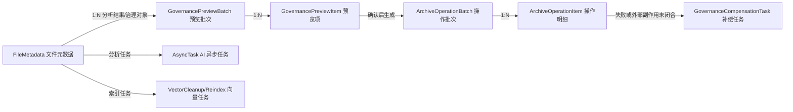
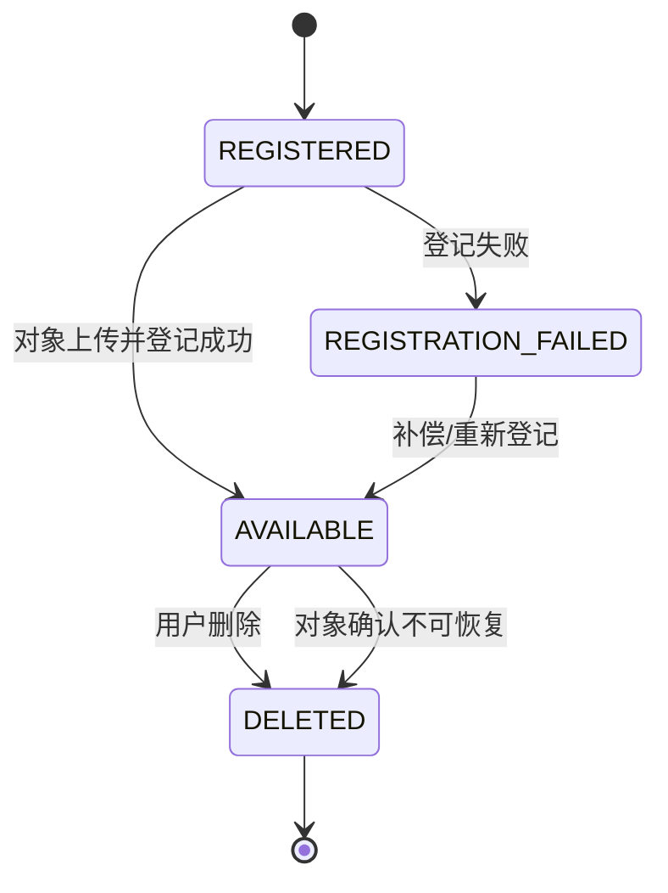

# Cofferer 文件治理领域模型

> **第一版历史模型。** 本文记录 C02 时的单用户数据库边界；多账号 owner 模型、三种部署和最终文件存储按[ADR-001](../../decisions/ADR-001-最终产品合同与存储架构.md)及[最终落地计划 R11/R20](../../plans/AgentFS最终落地执行计划.md)实施。不得把下文的单用户限制作为新需求。
>
> 本文完成 C02，承接 [Cofferer 第一版验收标准](./Cofferer第一版验收标准.md)，为 C03～C10 的数据库、接口和服务实现提供状态与一致性约束。
>
> 本文只定义领域模型和迁移设计，不新增实体、迁移或业务代码。实现时不得用当前已有的 `FileMetadata.status`、`archived` 或 `AsyncTask` 字段直接代替本文的全部状态轴。

## 1. 设计目标和边界

文件治理涉及四类不同事实：

- 文件对象现在是否可用。
- AI 分析是否完成，以及分析结果是否可以生成预览。
- 文件是否已经按用户确认的建议完成归档。
- 一次治理操作是否执行成功，以及之后是否已经撤销。

这些事实的生命周期不同，不能继续用一个布尔值或一个通用状态表达。第一版采用“文件元数据 + 预览批次 + 操作批次/明细 + 补偿任务”的模型：



第一版不引入用户、工作区、权限和多租户实体。单用户边界由应用层固定，数据库设计保留未来增加 `workspace_id` 的扩展位置，但本轮不添加该字段。

## 2. 领域对象

### 2.1 FileMetadata：文件治理的主体

`FileMetadata` 继续作为文件主体，负责文件身份、原始对象和当前正式状态。C03～C07 可以分阶段迁移，不要求一次性破坏现有 REST 字段。

现有字段与目标职责：

- `id`：稳定的内部文件 ID，操作台账和向量索引使用它关联文件。
- `fileName`：当前正式文件名；预览建议不得直接写入。
- `fileType`、`fileSize`：文件类型和大小。
- `storagePath`：当前正式对象路径。
- `category`：当前正式分类；预览中的建议分类单独保存。
- `summary`：当前正式摘要；预览中的建议摘要单独保存。
- `archived`：现有兼容字段，后续由 `archive_status` 推导或同步维护，不再作为唯一归档真相。
- `taskId`：兼容现有上传分析任务关联；新模型应逐步改为显式的文件与异步任务关联。
- `revision`：文件治理版本号，初始为 0；每次正式名称、分类、路径或对象内容发生受治理变更时递增。
- `content_etag`：对象内容指纹或 MinIO ETag，可为空；用于检测文件是否在执行或撤销前被替换。

文件必须同时具备以下状态轴：

- `lifecycle_status`：文件对象生命周期。
- `analysis_status`：AI 解析和建议生成生命周期。
- `archive_status`：正式归档生命周期。
- `index_status`：搜索索引生命周期。

### 2.2 GovernancePreviewBatch：预览批次

预览批次是一次分析结果的用户可见快照。它不是操作台账，不承担历史审计职责；预览可以过期、取消或重新生成。

建议字段：

- `preview_id`：字符串公开 ID，长度不超过 64。
- `source`：`UPLOAD`、`INBOX_IMPORT`、`REANALYZE`、`RETRY`。
- `mode`：分析时实际使用的 `API` 或 `LOCAL` 模式快照。
- `status`：预览批次状态。
- `created_at`、`expires_at`、`confirmed_at`、`cancelled_at`。
- `created_by`：第一版固定为 `LOCAL_USER`，为未来审计保留来源字段。
- `request_id`：生成预览的幂等键；重复请求返回原批次。

预览批次状态：

- `ANALYZING`：正在为批次生成预览项。
- `READY`：所有可分析项目已经生成建议。
- `PARTIAL_READY`：部分项目可预览，部分项目分析失败或不支持。
- `CONFIRMING`：正在创建操作批次，短暂状态。
- `PARTIALLY_CONFIRMED`：部分项目已确认，仍有项目未处理。
- `CONFIRMED`：可执行项目都已转成操作明细。
- `EXPIRED`：超过 `expires_at`，不得执行。
- `CANCELLED`：用户主动取消，不得执行。
- `FAILED`：预览批次级错误；单文件错误优先记录在预览项，不扩大为批次失败。

### 2.3 GovernancePreviewItem：预览项

预览项保存“分析时看到的文件快照”和“用户准备确认的建议”，两者必须分开。

建议字段：

- `id`：数据库内部 ID。
- `preview_id`、`file_id`：所属预览批次和文件 ID。
- `source_revision`：生成预览时的文件 `revision`。
- `source_path`、`source_file_name`、`source_category`：生成预览时的正式状态快照。
- `source_etag`、`source_size`：生成预览时的对象指纹和大小。
- `suggested_file_name`、`suggested_category`、`suggested_path`、`suggested_summary`：建议结果。
- `suggested_tags`：第一版可以使用 TEXT 保存规范化 JSON 字符串；它不是正式标签关系，确认后再转换为标签变更。
- `analysis_model`、`analysis_mode`：生成建议所使用的模型信息，不保存密钥。
- `status`：预览项状态。
- `skip_reason`、`error_code`、`error_message`。
- `confirmed_at`、`updated_at`。

预览项状态：

- `PENDING`：等待分析或等待用户处理。
- `READY`：有可展示的建议。
- `EDITED`：用户修改过建议，仍可确认。
- `CONFLICTED`：预览发现目标路径冲突，不得直接执行。
- `CONFIRMED`：用户确认，已经或即将生成操作明细。
- `SKIPPED`：用户主动跳过。
- `FAILED`：当前文件分析失败。
- `EXPIRED`、`CANCELLED`：随批次终止。

预览项必须通过 `source_revision` 和 `source_etag/source_size` 做乐观校验。文件在预览生成后发生变化时，不能直接套用旧建议，应重新分析或由用户明确重新确认。

### 2.4 ArchiveOperationBatch：操作批次

操作批次代表一次用户确认产生的治理命令，是台账查询和批量撤销的聚合根。

建议字段：

- `batch_id`：字符串公开 ID，长度不超过 64。
- `preview_id`：来源预览批次，可为空以兼容未来手工治理。
- `source`：`PREVIEW_CONFIRMATION`、`MANUAL_RETRY`、`ROLLBACK_RETRY`。
- `mode`：确认时锁定的运行模式；归档本身不调用模型，但保留上下文。
- `request_id`：确认请求幂等键，建立唯一约束。
- `status`：批次执行状态。
- `rollback_status`：批次撤销汇总状态。
- `total_count`、`success_count`、`failed_count`、`conflicted_count`、`skipped_count`。
- `failure_summary`：批次级摘要，不替代明细错误。
- `created_at`、`started_at`、`finished_at`、`rollback_started_at`、`rollback_finished_at`。

批次执行状态：

- `PENDING`：已创建，等待执行。
- `RUNNING`：至少一条明细正在处理。
- `SUCCEEDED`：全部选中明细执行成功。
- `PARTIAL_FAILED`：至少一条成功，且存在失败或冲突明细。
- `FAILED`：没有任何成功明细，或批次级校验失败。
- `CANCELLED`：执行前被取消；已经成功的明细不能通过取消伪装成未执行。

批次撤销汇总状态：

- `NOT_REQUESTED`：尚未发起撤销。
- `PENDING`、`RUNNING`：等待或正在撤销。
- `SUCCEEDED`：所有可撤销成功明细均已撤销。
- `PARTIAL_FAILED`：部分撤销成功，仍存在失败或冲突。
- `FAILED`：撤销请求无法开始或没有任何明细可撤销。

### 2.5 ArchiveOperationItem：操作明细

操作明细是最小执行和审计单位。批量执行必须逐条处理，不能只在批次上记录一个结果。

建议字段：

- `id`：数据库内部 ID。
- `batch_id`、`file_id`：所属批次和文件 ID。
- `item_key`：由批次、文件、目标快照和动作生成的幂等键，唯一。
- `expected_revision`：确认时文件版本。
- `source_file_name`、`source_category`、`source_path`：执行前快照。
- `target_file_name`、`target_category`、`target_path`：确认后的目标快照。
- `source_etag`、`source_size`：执行前源对象指纹。
- `target_etag`、`target_size`：新对象写入后的指纹，可为空。
- `pre_execute_revision`、`post_execute_revision`：执行前后文件版本。
- `execution_status`：本明细执行状态。
- `execution_step`：恢复执行需要的最近完成步骤。
- `rollback_status`：本明细撤销状态。
- `attempts`、`next_attempt_at`：重试调度字段。
- `failure_code`、`failure_message`：最近一次失败信息。
- `created_at`、`started_at`、`finished_at`、`rollback_started_at`、`rollback_finished_at`。

明细执行状态：

- `PENDING`：等待执行。
- `VALIDATING`：校验预览过期、文件版本和路径冲突。
- `COPYING`：正在写入目标对象。
- `DB_COMMITTING`：对象已写入，正在提交正式元数据。
- `CLEANUP_PENDING`：数据库已切换，旧对象待清理。
- `SUCCEEDED`：归档闭环完成；旧对象清理失败时仍可成功，但必须产生清理补偿任务。
- `FAILED`：可重试的执行失败。
- `CONFLICTED`：路径、版本或对象指纹冲突，等待用户处理。
- `SKIPPED`：用户跳过或因预览项未选择而不执行。

明细撤销状态：

- `NOT_REQUESTED`：尚未撤销。
- `PENDING`、`VALIDATING`、`COPYING`、`DB_COMMITTING`、`CLEANUP_PENDING`：撤销过程中的阶段。
- `SUCCEEDED`：已恢复原路径、原文件名和原分类。
- `FAILED`：可重试的撤销失败。
- `CONFLICTED`：原路径已被其他对象占用，或当前文件版本已变化。
- `NOT_REVERSIBLE`：缺少必要快照或外部对象已不可恢复，只能保留审计记录。

撤销状态与执行状态必须分开保存。例如：执行成功但撤销冲突时，`execution_status=SUCCEEDED`、`rollback_status=CONFLICTED`，不能把执行结果改写成失败。

### 2.6 GovernanceCompensationTask：补偿任务

MinIO 外部 IO 和数据库事务无法组成一个原子事务，因此需要持久化补偿任务。它不能复用 `AsyncTask`：`AsyncTask` 面向 AI 分析进度，补偿任务面向外部副作用收敛，重试和状态含义不同。

建议字段：

- `id`：数据库内部 ID。
- `operation_item_id`：关联操作明细 ID。
- `action`：`DELETE_TARGET_OBJECT`、`DELETE_SOURCE_OBJECT`、`RESTORE_SOURCE_OBJECT`、`RECONCILE_METADATA`。
- `status`：补偿状态。
- `attempts`、`next_attempt_at`、`last_error`。
- `payload`：必要的路径和对象版本快照，使用 TEXT 保存规范化 JSON；不得保存密钥。
- `created_at`、`updated_at`、`finished_at`。

补偿任务状态：

- `PENDING`：等待调度。
- `RUNNING`：正在执行。
- `RETRYABLE`：暂时失败，按退避时间重试。
- `SUCCEEDED`：外部副作用已收敛。
- `BLOCKED`：需要用户处理冲突，不得无限自动重试。
- `FAILED`：超过重试上限或出现不可恢复错误。

补偿任务应有唯一业务约束，确保同一明细的同一动作只有一个未完成任务。任务成功后不得删除历史记录，只更新状态，便于审计和故障排查。

## 3. 状态轴与允许流转

### 3.1 文件生命周期状态

`lifecycle_status` 只描述文件对象和元数据是否存在，不描述 AI 或归档结果：



第一版不物理删除操作台账。文件删除后，历史操作明细保留；`file_id` 作为历史引用保存，不建立会阻止删除的强外键。

### 3.2 AI 分析状态

- `NOT_STARTED`：尚未提交分析任务。
- `PENDING`：等待异步任务。
- `PROCESSING`：解析或模型调用中。
- `READY`：分析结果可生成预览。
- `FAILED`：本次分析失败，可重试。
- `STALE`：文件版本变化，原结果不能继续用于治理。

允许流转：

```text
NOT_STARTED -> PENDING -> PROCESSING -> READY
                                  \-> FAILED -> PENDING
READY -> STALE -> PENDING
```

现有 `FileStatus.PENDING/PROCESSING/COMPLETED/FAILED` 在迁移期间映射为 `analysis_status` 的 `PENDING/PROCESSING/READY/FAILED`，对外旧字段继续返回兼容值。

### 3.3 归档状态

`archive_status` 描述正式文件是否已按用户确认的治理结果归档：

- `INBOX`：仍在原始收件位置。
- `PREVIEW_REQUIRED`：已有分析结果，但没有有效确认结果。
- `READY`：已有有效操作明细，等待执行。
- `ARCHIVING`：归档执行中。
- `ARCHIVED`：当前正式路径和分类已切换到目标状态。
- `EXECUTION_FAILED`：归档失败，可重试。
- `CONFLICTED`：路径或版本冲突，需要用户处理。
- `ROLLING_BACK`：撤销执行中。
- `ROLLBACK_CONFLICTED`：撤销遇到冲突。
- `ROLLED_BACK`：已恢复到操作前正式状态。

归档成功不等于旧对象已经删除：旧对象清理失败时文件仍为 `ARCHIVED`，同时存在 `DELETE_SOURCE_OBJECT` 补偿任务。

### 3.4 索引状态

`index_status` 与治理执行解耦，避免归档失败或 Redis 暂时不可用阻塞文件治理：

- `NOT_REQUIRED`：未启用向量索引或文件类型不参与向量索引。
- `PENDING`：等待索引。
- `INDEXING`：向量生成或写入中。
- `INDEXED`：当前文件版本已建立索引。
- `STALE`：文件路径、内容或摘要变化，旧索引不可视为最新。
- `FAILED`：索引失败，可由现有向量补偿/重建任务处理。
- `DELETING`：文件删除后的向量清理中。

现有 `vector_indexed_at` 和 `vector_index_generation` 保留，作为索引成功时间和 generation 快照；迁移后由 `index_status` 补充表达状态。

## 4. 幂等、并发和补偿规则

### 4.1 幂等键

幂等键分三层：

- 预览幂等键：`preview_request_id`，作用域为分析来源和文件集合。
- 批次幂等键：`confirm_request_id`，作用域为一次确认请求。相同键重试必须返回原 `batch_id`。
- 明细幂等键：`item_key`，由 `batch_id + file_id + expected_revision + target_snapshot + action` 规范化后生成。

同一幂等键再次提交时：

- 参数完全一致：返回已存在对象的当前状态，不重复执行。
- 参数不一致：返回幂等键冲突，不修改原对象。
- 原请求处于 `RUNNING`：返回处理中，不创建第二个执行者。

数据库至少需要以下唯一约束：

- `governance_preview_batch.request_id`
- `archive_operation_batch.request_id`
- `archive_operation_item.item_key`
- 同一批次内的 `(batch_id, file_id)`
- 同一操作明细的未完成补偿动作

### 4.2 乐观并发校验

- 创建预览时记录 `source_revision`、源路径和对象指纹。
- 确认时重新读取文件，版本不一致则预览项转为 `CONFLICTED`，不创建可执行明细。
- 执行前以 `expected_revision` 和源路径为条件更新/锁定文件；更新影响行数不是 1 时视为冲突。
- 执行成功后把文件 `revision` 加 1，并把新版本写入 `post_execute_revision`。
- 撤销前要求当前版本等于 `post_execute_revision`，否则转为 `rollback_status=CONFLICTED`，不覆盖用户后来产生的变更。

第一版单实例继续使用现有 JVM 读写锁；数据库版本号负责防止同一文件的重复确认和撤销，不能用线程锁代替持久化校验。

### 4.3 外部 IO 与事务边界

归档和撤销都遵循以下原则：

1. 短事务读取并校验数据库状态。
2. 事务外执行 MinIO copy/存在性检查。
3. 短事务提交正式路径、分类、版本和操作阶段。
4. 事务外删除旧对象；失败则创建补偿任务。

数据库更新失败时：

- 如果目标对象已经写入，创建 `DELETE_TARGET_OBJECT` 补偿任务，文件正式状态仍保持原状态。
- 如果正式元数据已经切换，旧对象删除失败不回滚数据库，创建 `DELETE_SOURCE_OBJECT` 补偿任务。
- 服务在任意步骤崩溃后，由 `execution_step` 和补偿任务恢复，不依据内存中的异常或日志猜测结果。

## 5. 领域事件与现有模块边界

### 5.1 现有异步任务的定位

现有 `AsyncTask` 继续只表示上传/解析/AI 分析任务：

- `AsyncTaskStatus` 不扩展为归档、撤销或补偿状态。
- AI 任务完成只代表 `analysis_status=READY`，不能代表归档完成。
- 失败重试只重新提交分析任务；治理执行重试由 `ArchiveOperationItem` 自己负责。

### 5.2 标签和分类的定位

- AI 生成的标签仍先进入 `PENDING_CONFIRMATION`，但这不再等价于“可以直接归档”。
- 预览建议中的标签是快照，不写入正式 `file_tag_mapping`。
- 用户确认治理操作后，才在同一治理执行流程中提交正式分类、正式名称和需要的标签变更。
- 后续实现必须移除或改造 `TagConfirmedEventListener -> StorageArchiveService.archive` 的直接旁路，标签确认事件最多触发建议刷新或兼容迁移，不能绕过预览确认和操作台账。

### 5.3 向量索引的定位

- 归档操作成功后发布索引刷新事件；索引失败不影响归档批次结果。
- 文件路径、摘要、分类或内容变化时，把 `index_status` 标记为 `STALE`/`PENDING`。
- 现有 `vector_cleanup_task` 和 `vector_reindex_job` 继续独立运行，不并入治理操作台账。

## 6. H2 / MySQL 迁移方案

### 6.1 当前迁移版本

当前仓库已经维护 H2 和 MySQL 两套 Flyway V1～V14 迁移：

- V8：操作批次和操作明细。
- V9：收件箱导入记录。
- V10：治理预览批次和预览明细。
- V11：治理补偿任务。
- V12：全局模型运行模式。
- V13：模型运行端点配置。
- V14：归档对象名称保留和并发分配锁。

后续新增数据库结构必须从 V15 开始。每个新版本必须同时维护：

- `backend/src/main/resources/db/migration/h2/`
- `backend/src/main/resources/db/migration/mysql/`

不得修改已经执行过的 V1～V14；不得依赖 Hibernate 自动建表或 `ddl-auto=create/update`。

### 6.2 跨数据库类型约束

- 主键使用现有的 `BIGINT` 自增方式；公开批次 ID、预览 ID 和幂等键使用 `VARCHAR(64)`。
- 所有状态、来源、动作使用 `VARCHAR` 保存，不使用数据库原生 `ENUM`，避免 H2/MySQL 不一致和后续扩展困难。
- H2 使用 `TIMESTAMP`，MySQL 使用 `DATETIME(6)`，Java 统一使用 `LocalDateTime`。
- 路径、名称和错误信息使用 `VARCHAR` 或 `TEXT`；不依赖 MySQL 专有 JSON 类型。
- `payload`、建议标签和批次摘要使用 TEXT 保存规范化 JSON/文本，应用层负责校验结构。
- 所有查询字段建立普通索引；状态调度至少建立 `(status, next_attempt_at)` 复合索引。
- 由于历史台账必须在文件删除后保留，操作表不建立会阻止文件删除的强外键；关联完整性由应用服务和查询层负责。
- H2 和 MySQL 的迁移脚本必须保持同样的表、列、默认值、唯一约束和索引语义。

### 6.3 迁移兼容要求

- 旧数据迁移时：`revision` 默认 0；`content_etag` 允许为空。
- `FileStatus.COMPLETED` 映射为 `analysis_status=READY`；`archived=true/false` 映射为 `archive_status=ARCHIVED/INBOX`。
- 旧文件没有预览和操作台账时，不伪造历史批次；它们只能作为“历史存量文件”进入后续重新分析或手工治理。
- 新代码读取新状态轴，旧接口响应暂时由适配器继续返回 `status` 和 `archived`，直到前端契约完成迁移。

## 7. 核心状态约束

实现阶段必须满足以下不变量：

- `execution_status=SUCCEEDED` 时，必须存在目标路径、目标文件名和目标分类快照。
- `rollback_status=SUCCEEDED` 时，必须存在原始路径、原始文件名和原始分类快照。
- `execution_status=CONFLICTED` 或 `rollback_status=CONFLICTED` 时，不得覆盖任何非本操作明确持有的对象。
- `archive_status=ARCHIVED` 时，数据库当前路径必须指向目标路径；旧对象清理失败只能产生补偿任务，不能把归档改为失败。
- `analysis_status=READY` 不代表 `archive_status=ARCHIVED`。
- `index_status=INDEXED` 不代表归档成功；归档也不等待向量索引成功。
- 任何批次汇总状态都必须由明细状态计算或在同一事务内更新，不能只相信前端提交的计数。
- 文件删除不能删除操作台账和补偿任务。

## 8. C03 实现拆分

C03 只实现操作台账最小闭环，建议按以下顺序落地：

1. 先创建 `archive_operation_batch` 和 `archive_operation_item` 的 H2/MySQL 迁移。
2. 创建对应实体、枚举和 Repository，先补唯一约束、状态字段和查询索引。
3. 增加 Flyway 迁移测试，验证 H2 与 MySQL 脚本的列、约束和索引语义一致。
4. 暂不在 C03 中实现 Dry-run、归档执行和撤销服务；这些分别由 C05～C10 使用本文模型实现。
