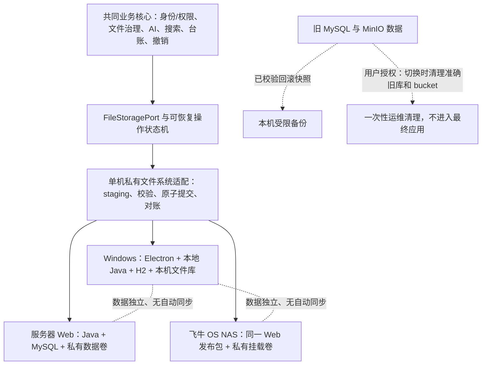
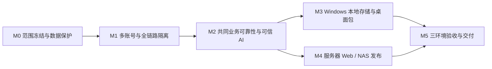

# AgentFS Nexus 最终落地执行计划

> 版本：2026-09-25 · 执行基线。适用目标：Windows 桌面版、服务器 Web 版和 NAS 版均交付；三种安装实例各自保存独立数据；每个实例支持多账号及管理员/普通用户隔离。用户已确认“重新分析后正式标签集合”问题解决，它只保留为发布回归用例。
>
> 本文替代旧的 C17–C20 线性收尾顺序和 C21–C26 桌面实施顺序，保留 C01–C16 已实现的业务成果。M0 证据见[盘点与保护记录](./M0-存量数据盘点与保护记录.md)，产品合同见[ADR-001](../decisions/ADR-001-最终产品合同与存储架构.md)，需求追踪见[需求追踪矩阵](./需求追踪矩阵.md)，选题材料口径见[范围变更说明](../product/选题报告范围变更说明.md)。M0 的清理步骤只在维护窗口执行；本文档更新本身不删除线上旧数据。

## 0. 最终交付的定义

交付的是**一套共享业务核心、一种正式文件系统适配、三种经过环境验收的部署形态**：

- **所有形态的共同能力**：多账号登录与隔离、文件导入/解析、AI 建议、预览编辑、确认归档、操作台账、单项/批次撤销、检索与真实来源引用、模型 API/本地模式、敏感内容提示、失败重试与恢复。
- **Windows**：本地文件库是文件正文的唯一权威存储；H2 使用独立生产 Profile；Electron 只承担窗口和本地服务生命周期。无需用户安装 JDK、Node、MySQL、MinIO。断网或模型不可用时，已有文件仍可读取和人工管理。
- **服务器 Web / NAS**：MySQL 保存正式元数据，后端写入各自的私有本地挂载卷；前端使用生产静态资源，后端由容器/服务管理；两者使用同一套发布包，在服务器与飞牛 OS 实机分别验收。
- **账号**：管理员只管理账号与非内容型系统设置，默认不得通过应用查看普通用户的正文、文件名、摘要、标签、预览、台账、检索结果、引用、聊天与内容日志。普通用户只能访问自己的资源；不提供公开注册和用户间共享。
- **威胁边界**：上述“管理员不可读”指应用角色权限。拥有主机、数据库、备份或 Windows 文件系统权限的运维人员属于可信基础设施边界；若未来要求连宿主机管理员也无法读正文，应另立用户持钥加密项目，不可用现有明文解析架构承诺。
- **明确不交付**：桌面/Web/NAS 自动同步、协作共享空间、多实例同时写一个库、音视频分析、完整 DLP、Web 正文在线编辑、macOS/Linux 桌面包。

### 对原设计作出的更改

1. **单用户改为多账号。** 最新选题报告和本次确定的目标优先于旧 C01“无登录”定义；身份与隔离必须先于桌面存储和公开部署完成。
2. **最终应用完全移除 MinIO。** 官方仓库已归档为只读，参见[官方发布页](https://github.com/minio/minio/releases)。用户决定旧单用户数据不迁移；切换前对旧实例做快照与核验，在维护窗口清理准确旧库和 bucket。最终应用、Docker 镜像与 Electron 包不包含 MinIO SDK、服务、镜像或应用内迁移适配器。三种新安装各自使用本地受控文件卷并建立独立、可恢复备份。
3. **导入默认复制。** 先将源文件复制到 staging、校验 SHA-256、完成登记，再让用户选择是否删除外部原件。跨卷“移动”不具备可靠原子性，不能作为默认无损导入动作。
4. **目标名称在预览中固定。** `000`–`FFF` 序号可用于分配候选路径，但最终路径必须在预览页展示；确认时锁定并复核。发生冲突时阻塞，不在确认后静默改名或覆盖。
5. **撤销恢复完整正式状态。** 当前 `ArchiveRollbackPersistenceService` 主要恢复路径、名称和分类；新台账需保存归档前的正式标签、摘要等被改字段，撤销时按版本校验完整恢复，同时更新检索索引。
6. **把成功定义为数据库与正文的可核对状态。** 上传、分析、归档、撤销和删除都使用持久操作/任务记录、幂等键与启动恢复，不再仅依赖提交后的内存事件或“失败只记日志”。

## 1. 执行原则与依赖

每项任务在合并前附上：代码/迁移、自动化用例、人工验收步骤、失败处理和文档更新。每个里程碑结束时保存可运行产物、数据库版本、接口契约、回归结果和未关闭风险。C19 测试与 C20 文档贯穿所有阶段，不留到最后一周集中补。

### M0：统一产品合同并保护存量数据

**R00｜建立唯一验收基线。**

- 已为旧 C01 验收标准、C01–C16 交接/领域模型、C17–C26 清单、部署方案和代码 Wiki 增加历史范围提示；选题报告另附范围变更说明。需求到决定、实现、自动/人工验收及证据的追踪表见[需求追踪矩阵](./需求追踪矩阵.md)，后续每项实现须持续填写真实结果。
- 将 ISSUE-001 记录为“用户确认已解决（2026-09-25）”，保留标签集合替换回归，不再安排重复排障。
- **完成判据**：任一用户可见行为只有一份有效定义；旧文档的冲突有明确废止或修订记录。若选题报告已正式提交，先完成其变更/说明材料，再使用新架构作为答辩标准。

**R01｜冻结权限、数据与失败语义。**

- 已形成 ADR-001，冻结管理员/普通用户权限边界、私有派生数据、旧单用户数据不迁移、模型授权、三实例数据独立、单机私有文件卷、路径冲突和失败语义。
- 已确认 NAS 操作系统为飞牛 OS；当前不虚构具体型号和资源数值。R43 在选定实机后冻结型号/架构/文件系统/卷权限和实际部署基线；R52 在目标硬件基准后冻结最低 CPU/内存/磁盘、文件数量/容量、并发账号和 RPO/RTO。不得拿模拟器或临时容器代替最终实机验收。
- **完成判据**：当前产品、身份、数据权威、威胁和失败合同均无悬而未决矛盾；每个硬件/容量未知值都有责任项和 R43/R52 冻结门槛。硬件细节不阻塞 R10–R26 的业务核心工作。

**R02｜盘点、备份和旧数据归属。**

- 盘点当前 MySQL/H2、MinIO 对象、标签、预览、台账、模型密钥、Redis 可重建数据与历史 UUID 对象；记录数量、引用关系和正文 SHA-256。完成的快照和恢复核对见 M0 记录。
- 用户已决定不迁移旧单用户业务数据，可在新实例切换维护窗口中清理旧业务表和旧 bucket。清理前仍要冻结写入、二次校验快照、导出清理范围和摘要；只删除旧 schema 中 Flyway 以外的业务行与确切 agentfs-bucket，不删除 schema、Flyway 历史、其他 bucket、工作区 H2/Redis 文件或唯一回滚备份。不得把本机开发数据库误当成生产清理目标。
- 现存快照中 2 条文件正文引用缺失、14 条历史归档明细的源/目标对象均缺失、92 个对象是未引用候选；旧业务清理前必须导出这些异常摘要。它们不迁移、不被静默修复。
- **完成判据**：MySQL 与 MinIO 隔离恢复证据和摘要校验完成；用户确认的旧业务数据清理范围可复现、可回滚；剩余备份保留到新系统验收与约定保留期结束。

**R03｜搭建持续验收骨架。**

- 基础 CI 已连接用户指定的 GitHub 仓库 `https://github.com/whiteCQian/Coffer.git`。工作流为后端运行 Maven `verify`（使用隔离 Redis 8 与 Adobe S3Mock 5.2.2），前端执行 `npm ci` 和生产构建；提交 `b4cafb2` 的后端与前端 job 均成功，见[GitHub Actions 运行记录](https://github.com/whiteCQian/Coffer/actions/runs/36127838415)。
- 基础门禁已完成。后续仍须补齐 OpenAPI 生成差异检查、依赖漏洞扫描、H2/MySQL 迁移升级矩阵和文件系统故障注入；Redis 按可选/可重建依赖测试。OpenAPI job 应在接口契约生成稳定且无需外部服务后加入。将成功运行设为 M1 及后续阶段的合并门禁，并在分支保护中强制要求两个基础 job。
- **完成判据**：基础后端、前端各有成功 hosted run（已满足）；增强门禁随对应迁移、契约和故障用例实施，并在其任务验收前成为必须通过的 CI job。

### M1：多账号、身份和全链路数据隔离（所有后续工作的前置门禁）

**R10｜账号与会话。依赖 R01。**

- 增加首次管理员初始化、管理员建用户/停用用户/重置凭据、用户登录/退出/改密、会话过期与强制撤销。采用服务端会话与受保护 Cookie，写接口防 CSRF；对登录、密码重置与模型测试设置速率限制。禁用公开注册。
- 使用数据库持久化服务端会话（H2/MySQL；Redis 不作为登录可用性的前提）；设置 HttpOnly、Secure、SameSite Cookie、CSRF、防会话固定、过期与主动撤销。密码使用成熟自适应哈希保存，绝不存明文或可逆密码。
- 记录最小化账号审计：谁在何时创建/停用账号、重置凭据、修改全局设置；审计中不出现私有文件内容。
- **完成判据**：三种身份（管理员、用户 A、用户 B）可完整走通页面；停用/退出后旧会话失效；直接调用 API 与页面规则一致。

**R11｜所有权模型与存量迁移。依赖 R02、R10。**

- 自 Flyway V15 起增量增加 `app_user`、个人工作空间和必要的 `owner_id`：文件、标签字典及映射、任务、收件箱记录、预览、归档批次/明细、补偿、聊天、模型日志、模型端点/密钥、向量任务、归档名称保留。归档名称唯一键包含 owner；标签名字典与关系改为用户范围。
- 本项目不做旧匿名数据 owner 回填。R02 已获用户明确授权清除旧业务数据；上线切换必须先停止旧服务写入、完成可恢复快照和行数/对象摘要，然后只清空旧 agentfs schema 的业务行与准确的 agentfs-bucket，保留 Flyway schema/迁移历史及回滚备份，再升级到有 owner 约束的新 schema 并初始化管理员。清理脚本 dry-run 必须列出库名、表数/行数、bucket 名/对象数和备份指纹；检查通过后才可确认执行。H2/MySQL 两套迁移脚本一致；开发机备份与其他数据不得被部署清理脚本误选。
- **完成判据**：全新/已清空实例升级后所有新增业务资源必须具有有效 owner；旧数据清理的行数、对象数、摘要与快照可核对、可恢复；初始化后没有无 owner 数据，不把任何旧资源隐式归给管理员。

**R12｜服务层与后台任务授权。依赖 R11。**

- 所有按 `fileId`、`taskId`、`previewId`、`batchId`、`sessionId`、对象路径查询或修改的入口，都从服务端认证主体解析 owner；Repository 查询带 owner 条件。后台任务把 owner 与操作意图持久化，不能依赖请求线程的 ThreadLocal。
- 管理员接口只返回账号与聚合运行状态；文件名、摘要、标签、路径、台账明细、补偿错误、导出和日志视为私有数据。跨用户资源返回统一的不可枚举错误语义。
- **完成判据**：猜测另一用户的 ID、路径、导出链接或后台任务 ID 均不能读/改/重试；管理员也不能通过这些入口看到用户内容。

**R13｜搜索、Agent、记忆和引用隔离。依赖 R12。**

- 将 owner 显式传入 `FileSearchTool`、`FileParsingTool`、最近上传、`HybridSearchService` 的词法/标签/向量两路，以及异步检索线程；**在结果送入模型前**按 owner 过滤。Redis 键、向量 generation 和聊天 session 归属均包含/校验 owner；引用点击时再次检查授权和文件版本。
- 对管理员禁止通过自然语言工具间接搜索用户文件；模型产生的文件 ID 不可作为授权凭据。
- **完成判据**：A/B 两账号和管理员的关键词、向量降级、最近上传、`parse_file`、会话 ID 猜测和历史引用交叉测试均无跨用户结果或内容进入模型上下文。

**R14｜模型配置与内容日志隔离。依赖 R10、R12。**

- 当前全局 API/本地模型模式和端点改为用户作用域，或采用管理员公布的受限端点清单且由用户明确确认。任务记录配置版本、模式、端点标识；配置改变不改变运行中任务，更不能由管理员静默改写用户正文去向。
- 默认关闭请求/响应正文日志；`model_call_log` 仅保留必要的用量和错误分类，定义保留、删除和用户查看规则。加密主密钥与用户 API Key 分层管理。限制端点 URL 的协议、主机/内网访问和重定向，防止模型测试成为内网探测入口。
- **完成判据**：用户能在提交 AI 任务前识别内容将发送到哪个端点；注入带标记的正文/密钥后，应用日志、错误响应和管理员视图都找不到标记。

**R15｜登录、管理员和隐私页面。依赖 R10–R14。**

- 前端增加登录、首次初始化、账号管理、无权访问、会话失效、用户模型设置和私有数据删除/导出交互；移除“本地单用户”文案。全局 UI 状态在切换账号/退出时清空，禁止把上一用户的文件、引用或缓存展示给下一用户。
- **完成判据**：三种身份在同一浏览器和桌面窗口轮流登录时不串页面状态；管理员页面无私有文件入口和数据回显。

**M1 退出门槛：**双用户 + 管理员越权矩阵全通过；越权读取/修改/模型上下文泄露次数为 0。未过此门槛，不进入对外部署或桌面打包。

### M2：共同业务可靠性、文件访问和可信 AI

**R20｜统一存储端口、路径与文件身份。依赖 M1。**

- 定义 FileStoragePort 的写入、范围读取、stat、SHA-256、复制/移动、删除、no-overwrite 和冲突检查；桌面、Web/NAS 正文都由单机本地文件系统适配器负责。上传、解析、预览、归档、撤销和文件访问只依赖端口。移除 MinIO SDK、MinioClient、BucketInitializer、MinIO 专用配置和相关依赖。业务记录保存 owner、逻辑路径、内容指纹和 revision，不存桌面绝对路径。
- 服务端文件根目录由部署卷显式提供，Web 静态目录不可访问；按 owner 隔离逻辑命名空间。统一路径规范，处理 Windows 大小写、Unicode、尾点/空格、设备名、路径穿越、符号链接和连接点；检查规范化后的实际路径始终在配置根目录内。
- 文件写入采用同卷 staging、长度/摘要校验、flush/持久化与原子 rename；跨卷移动拆成持久化的 copy-verify-commit-cleanup 流程。NAS 首发只支持经实机验证的单机本地挂载卷，不承诺 NFS/SMB 多主写或集群共享写入。
- 不保留旧 MinIO Key 的应用内兼容读取；旧数据由 R02 清理，不迁入新 owner。过渡版本不能在旧对象尚未完成备份/清理前发布。
- **完成判据**：三种部署均只能经鉴权接口读取正文；两个不同 owner 可有同名文件，同一 owner 的目标冲突不覆盖；恶意路径/链接无法越过根目录；断电/进程强杀后操作可恢复或进入人工处理态。

**R21｜持久化文件操作与处理任务。依赖 R20。**

- 为上传、导入、归档、撤销、重命名、删除、工作副本保存建立持久操作意图、步骤状态、幂等键、任务租约、退避重试、上限与人工处理态；执行前写意图，文件 I/O 后更新状态，启动时扫描恢复。修复上传提交失败留孤儿、数据库删除后正文清理失败只记日志、AFTER_COMMIT 内存事件丢失造成的 PENDING 悬挂。
- 做数据库/对象/本地文件三方对账：无引用对象先隔离并保留期处理，缺失对象进入可见异常，不自动把台账标成功。删除采用逻辑不可见与持久物理清理任务，定义备份保留与最终删除时间。
- **完成判据**：在每个持久化步骤后强杀进程、重启，文件未丢失/覆盖/重复归档；每个失败都有可查询的状态和恢复动作，无永久 PENDING。

**R22｜治理与撤销完整性。依赖 R20、R21。**

- 移除 `TagConfirmedEventListener → StorageArchiveService.archive` 与 `FileOperationService.changeCategory` 的直接归档旁路；所有正式位置/分类变更统一走“预览→确认→操作台账”。
- 台账保存操作前后的正式字段快照，至少包含名称、路径、分类、摘要、确认标签、归档态、revision 和对象 SHA-256；撤销按版本/内容校验恢复完整快照并重建检索索引。旧台账缺字段时标明“只能部分恢复”，不伪造历史数据。
- 确认后的正式标签必须与用户确认集合完全一致；该已修复问题保留普通预览、重新分析、失败重试和幂等回归。
- **完成判据**：重复确认/撤销幂等；批次单项失败相互隔离；冲突不覆盖；撤销后数据库、对象和标签/摘要与保存的原快照一致；台账不能在事实不一致时显示成功。

**R23｜受控文件读取与导出。依赖 R12、R20。**

- 新增按身份鉴权的文件流接口，支持浏览器预览/下载、Range、类型和安全响应头；替换默认 7 天 MinIO 预签名 URL。删除或撤权后旧入口不能继续读取；桌面按相同 API 从本地文件流返回。
- 修复 CSV 导出公式前缀注入，导出仍逐项校验 owner；限制单次导出数量和资源消耗。
- **完成判据**：未授权账号和已失效会话无法通过文件 ID、URL 或导出读取内容；以 `= + - @` 开头的文件名在表格中仍作为文本。

**R24｜统一解析结果、来源位置和资源上限。依赖 R13、R20。**

- 定义 `ParsedDocument`/片段结构：fileId、revision、格式、原文片段、来源位置、解析器版本和错误码。TXT 保存行/字符范围，PDF 保存页码，Word 保存段落定位，图片指向原图；聊天引用与建议只能引用真实解析片段。
- 上传、收件箱和桌面导入统一限制文件大小、真实类型、PDF 页数、图像像素、解析时间/内存及损坏/加密文件行为；防 ZIP/Office 解压膨胀与本地符号链接/重解析点逃逸。
- **完成判据**：支持格式样本可从引用定位到原文；坏文件、超限文件和不支持格式状态明确，不能生成猜测性摘要/建议；失败不会拖垮进程或丢原件。

**R25｜敏感识别和模型授权。依赖 R14、R24。**

- C17 改为**发送远端模型前**的门禁：文件名/扩展名及本地解析文本规则识别证件、财务、Token、私钥等；默认阻止命中内容发送 API 模式，用户查看目标端点后显式允许本次处理。图片、解析失败等无法在本地判定的正文按“未知”处理，同样需要逐文件明确授权。LOCAL 模式显示本地端点；两种模式都不静默回退。
- 记录谁在何时批准何文件/版本发送至何端点，但审计记录不含正文；文件重新上传或端点改变必须重新判断。
- **完成判据**：命中规则且未经确认的样本不会触发远端请求；经确认仅该文件版本可发送；模型失联时文件仍可查看且任务可重试。

**R26｜隐私、错误与运行状态收口。依赖 R21–R25。**

- 统一脱敏日志、异常响应、密钥旋转和数据保留；生产关闭调试接口、H2 Console、SQL/请求正文日志。管理员仅看聚合健康与积压，不能通过错误信息、监控标签或文件名泄露用户内容。
- 区分 liveness/readiness；监控任务积压、补偿、数据库/对象存储连接、容量、备份新鲜度。页面显示失败原因与下一步操作，避免“显示成功但事实不一致”。
- **完成判据**：模拟依赖故障时状态/告警/页面一致；敏感标记在日志、指标、错误和管理员视图中均不可检索。

**M2 退出门槛：**在文件系统适配器与 MySQL 隔离环境上通过新文件、两账号的核心治理/恢复场景；最终运行进程无 MinIO 连接或 SDK 依赖；源码中无未受控的直接归档旁路。

### M3：Windows 本地文件库与桌面应用

**R30｜桌面生产 Profile 与数据目录。依赖 M2。**

- 建立独立 `desktop` Profile：H2 嵌入式单进程、Flyway validate、关闭 H2 Console/DevTools、后端仅监听 loopback；业务数据与安装目录分离。桌面应用与本地数据库同一进程生命周期，不能沿用开发 `AUTO_SERVER=TRUE` 配置。
- 会话记忆改为数据库实现，Redis 向量作为可选能力；桌面不以 Redis/MinIO 为启动硬依赖。首次初始化生成本机密钥并纳入备份流程；文件库标识包含 UUID/格式版本和绑定校验。
- **完成判据**：干净 Windows 环境上无需预装 MySQL/Redis/MinIO 即可启动基本业务；同一库不能被第二进程误写；缺失根目录/密钥时清楚报错且不自动创建空的新库掩盖旧数据。

**R31｜本地安全导入。依赖 R20、R30。**

- 文件库按 owner 隔离 `inbox/managed/work/quarantine/lost-found`；空目录初始化和根目录重绑定检查。导入先复制到同盘 staging、校验大小/sha256、fsync/安全重命名，再登记任务；跨盘和文件占用失败时源文件仍保留。
- 收件箱扫描明确归属用户，拒绝任意符号链接/连接点越界和不受控目录；同名目标必须按预览中展示的路径确认。
- **完成判据**：目录非空/不可写拒绝初始化；中文名、跨盘、断电、磁盘满、重复文件和两账号同名导入均有可恢复结果；默认不删除外部原件。

**R32｜本地治理、撤销与恢复。依赖 R21、R22、R31。**

- 同一套治理用例通过本地存储适配执行；在目标目录写临时文件并校验后安全提交，不能覆盖已有目标。文件/DB 步骤间沿用持久化意图和启动对账；源对象清理最后执行。
- **完成判据**：关闭网络、强杀后端、重启后仍可查看本地文件并恢复未完成操作；预览不污染正式文件；归档/撤销/删除失败状态可追踪。

**R33｜工作副本编辑与冲突。依赖 R31、R32。**

- 外部应用只能编辑 `work` 中的副本；保存时比较正式文件 revision、sha256、大小和修改时间，成功后生成新版本并重新分析/建索引。冲突时保留原文件与工作副本，用户可另存或放弃，不自动覆盖。
- **完成判据**：Office 文件被占用、原件中途变化、应用崩溃、未保存退出等场景均有可见结果；正式文件不会被外部程序直接改写。

**R34｜Electron 启动器和安装包。依赖 R30–R33。**

- 将 Vue 生产资源、Java 后端和兼容 JRE 一起打包；单实例启动、进程归属、健康检查、端口冲突、异常退出和升级处理。渲染进程禁用 Node 集成、启用 context isolation 与 sandbox，IPC 只暴露经过参数/来源校验的最小能力；后端随机本机口配启动令牌并保持用户登录授权。
- 安装/升级/卸载将用户数据目录与程序目录分开；卸载默认保留数据并明确提示。提供包校验值，若可用则签名发布包。
- **完成判据**：干净 Windows 机器双击安装后完成初始化、登录和核心闭环；不打开 Vite 开发服务器，不依赖 `start-all.bat` 或开发机绝对路径；普通本地网页不能调用桌面后端敏感接口。

**R35｜桌面备份、恢复与升级。依赖 R30–R34。**

- 对 H2 使用一致性备份机制，连同本地文件库、配置和加密主密钥生成可验证且静态加密的备份包；备份副本存放在独立介质，不能只有原机同盘一份。恢复到新机器时校验账号、文件 sha256、台账、未完成任务和密钥。升级前备份，迁移失败可恢复整套旧数据。
- **完成判据**：在另一台干净 Windows 环境成功恢复含两用户、中文文件与未完成操作的样本；缺少密钥或文件时拒绝假成功。

**M3 退出门槛：**Windows 安装包在无开发依赖机器通过双账号、离线读取、归档/撤销、工作副本、崩溃恢复和备份恢复。

### M4：服务器 Web 与 NAS 生产发布（可与 M3 并行）

**R40｜生产构建与 Compose。依赖 M2。**

- 构建静态前端、后端镜像和可版本化 Compose；MySQL 和专用文件数据卷必需，Redis 为可选可重建服务。新生产栈不启动 MinIO。固定支持版本、健康检查、就绪顺序、备份/恢复卷规则。后端不依赖开发机路径或 localhost 固定数据库地址，使用最小权限数据库账号。
- 只通过反向代理公开 HTTPS 前端/API；MySQL 与 Redis 不直接暴露到非可信网络，文件卷不挂入静态 Web 根目录。生产禁用调试接口和正文请求日志。
- **完成判据**：全新服务器用发布说明一次安装、首次初始化、双账号核心流程和重启恢复；不以 Vite dev 服务作为生产前端；数据卷权限与不公开边界有自动化或部署检查证据。

**R41｜Web 安全与容量。依赖 R40。**

- 配置 TLS、Cookie/CSRF、安全头、会话生命周期、上传配额、账号任务并发和数据卷容量预警。文件下载经 R23 的授权入口；数据卷私有且仅后端可写。数据库/备份密钥单独管理，避免默认 root/空密码及生产明文连接配置。
- **完成判据**：外网只开放预期 HTTPS 端口；弱口令/暴力尝试受限；用户 A/B/管理员越权矩阵与 M1 相同；达到限额时返回可解释错误而非填满磁盘。

**R42｜Web 备份、恢复与升级。依赖 R40。**

- 设计 MySQL 与文件卷的一致恢复点，连同模型加密主密钥、配置和版本清单生成静态加密备份；至少保留一份脱离 NAS/服务器主机和生产凭据的副本。通过维护/快照窗口或持久操作屏障保证 DB 元数据与正文属于同一恢复点。Redis 会话与向量按规则清空/重建。Flyway 升级前留快照，无法向下迁移时通过整套快照恢复，不只回退旧 JAR。
- **完成判据**：在隔离服务器恢复双账号样本，文件 sha256、所有权、台账和密钥均一致；完成一次失败升级后回滚演练，记录 RPO/RTO。

**R43｜NAS 实机适配与验收。依赖 R40–R42。**

- 在用户确认的飞牛 OS 目标 NAS 记录具体设备型号、CPU 架构、文件系统、容器/卷/权限、网络和资源配置；使用与服务器 Web 相同的镜像部署，但使用该实例独有 MySQL 与文件卷。验证 NAS 重启、卷重挂、空间不足、长路径、原子 rename、权限和备份恢复。
- **完成判据**：目标 NAS 实机完成双账号全流程和故障恢复；提交真实设备/版本/卷配置与结果证据。模拟环境只能用于开发，不能代替 NAS 交付证据。

**M4 退出门槛：**服务器 Web 和 NAS 各自能独立安装、升级、恢复、运行多账号业务；两者数据互不共享。

### M5：全矩阵验收、文档与最终发布

**R50｜共享业务回归。依赖 M3、M4。**

- 用同一组 TXT/PDF/DOC/DOCX/图片/损坏/加密/超限文件，在 Windows、服务器 Web、NAS 分别运行：导入→解析→预览修改→部分/全量确认→归档→搜索/引用→台账导出→单项/批次撤销→删除。
- 加入已解决标签问题的四条路径、旧数据升级、多账号同名、文件再次修改、模型切换/失联、端点变更授权。每一步核对 API、DB、对象/本地文件 SHA-256 与页面状态。
- **完成判据**：三环境同一业务不变量成立；成功状态与事实不符为 0，静默覆盖/丢失为 0。

**R51｜权限与故障注入矩阵。依赖 R50。**

- 三身份 × 列表/详情/正文流/搜索/向量/Agent 工具/引用/预览/确认/撤销/导出/模型配置/后台任务，逐项测直接 ID 和会话 ID 猜测。管理员不能通过健康、日志或异常看内容。
- 在对象写入、DB 提交、事件投递、归档复制、旧对象清理、撤销和备份阶段模拟进程强杀、网络断开、磁盘满、权限不足和服务重启。
- **完成判据**：越权读取/修改为 0；每个中断点恢复后状态可解释、可重试或明确需要人工处理，没有无限 PENDING 或假成功。

**R52｜性能、资源、隐私与可用性。依赖 R50。**

- 在 R01 固定的硬件与样本规模上测上传登记、列表/搜索、预览生成（区分模型外部耗时）、批量归档、内存与磁盘峰值；验证多账号并发、限流和恢复时间。检查键盘基本操作、错误提示、中文文件名、时区与长路径。
- 做依赖/许可证清单、敏感内容标记泄露检查、日志保留与删除检查；生产故障面板只给管理员聚合指标。
- **完成判据**：满足 R01 冻结的指标；超出指标必须修复或在发布范围中明示限制，不能事后移动门槛。

**R53｜文档、运维手册和毕业设计证据。依赖 R50–R52。**

- 更新 README、部署矩阵、角色说明、安装/升级/卸载、模型隐私提示、预览/冲突/撤销、备份恢复、故障处理、API 契约及数据库图；整理 C01–C16 历史与新实现差异。
- 留存三环境版本和硬件、步骤、截图、接口响应、DB/对象指纹核对、权限拒绝、故障恢复记录和性能数据；论文只写实际通过的结果。
- **完成判据**：第三人依据发布包和文档可在空环境复现安装和核心验收；证据能追溯到构建版本与测试数据集。

**R54｜正式发布门禁。依赖 R53。**

- 冻结版本、迁移号和安装包/镜像摘要；审阅所有未关闭问题。P0/P1 缺陷、越权、数据丢失/覆盖、恢复失败和三环境核心验收失败一律阻止发布。允许的非阻断限制必须有用户可见说明和后续任务。
- **完成判据**：Windows 安装包、服务器 Web Compose、NAS 实机记录、恢复包/说明、自动化报告、人工验收证据和版本说明齐全；发布后能按同一运行手册监控、备份、升级与回滚。

## 2. 优先级、并行与预计工期

- **关键路径**：M0 → M1 → M2 → M3/M4 → M5。M0–M5 各阶段的退出门槛和 R54 均为最终交付硬门槛；桌面、服务器 Web、NAS 任一形态不能省略。
- **可并行**：M1 完成后，前端管理员页面与后端授权矩阵可分工；M2 完成后，Windows 本地适配和 Web/NAS 部署可并行；测试与文档随各任务同步推进。
- **单人全职粗估**：M0 1–2 周，M1 3–5 周，M2 3–5 周，M3 4–6 周，M4 2–4 周，M5 2–4 周；部分并行后整体约 **13–22 周**，再加 NAS 实机、安装签名/环境准备等外部等待。原“4–7 周桌面专项”估计未包含多账号和三环境验收，不可继续作为承诺。
- **时间不足时可删减的范围**：可选 Redis 向量检索、额外音视频格式、跨实例同步、细粒度共享空间和高级规则引擎。MinIO 镜像和 MinIO 运行依赖已从正式方案移除，不作为可选延期功能。不能删减三环境交付、多账号隔离、数据保护、预览确认、台账撤销、受控引用、备份恢复与故障验收。

### 与旧任务的对应关系

- **C01–C16**：复用现有治理、解析、检索和模型配置成果；通过 R11–R26 补全多账号、状态一致性、来源定位和隐私边界，再由 R50 全量回归，不把旧交接文档的“完成”直接当作三环境验收结果。
- **C17**：R25 的敏感/未知内容远端发送门禁。
- **C18**：R40–R43 的服务器 Web Compose、NAS 实机部署和恢复；Compose 使用专用本地文件卷，不包含 MinIO。
- **C19**：R03 建立自动化入口；R10–R52 各任务随实现验收，R50–R52 完成跨环境回归、越权与故障矩阵。
- **C20**：R00 修订冲突基线，R53–R54 完成可复现的安装、运维、验收和发布文档。
- **C21–C22**：R20、R30–R31 实现存储端口、本地文件库和无损导入。
- **C23**：本地归档由 R21、R32 实现；强制 MinIO 镜像取消，以 R35 的可恢复备份代替。
- **C24–C26**：R22、R32–R35 完成治理/撤销、工作副本、Electron 打包与备份恢复。

## 3. 发布验收总清单

- [ ] 三种环境使用同一业务规则和 API 契约，桌面与服务器/NAS 的数据独立。
- [ ] 双普通用户 + 管理员的越权成功次数为 0；管理员应用视图没有私有内容。
- [ ] 预览前正式元数据和正文不改变；确认后标签等于最终确认集合。
- [ ] 归档、撤销、删除和工作副本在重试/崩溃后没有静默丢失或覆盖；事实不一致不显示成功。
- [ ] TXT/PDF/Word/图片引用可追溯到原文或原图位置；异常格式不生成猜测性结果。
- [ ] API 模式发送敏感内容前获得明确授权；LOCAL 模式无云端静默回退；日志和管理员视图无正文/密钥。
- [ ] Windows 干净机器可安装、离线读文件、双账号使用、升级和恢复；无开发机依赖。
- [ ] 服务器 Web 与目标 NAS 均以生产包完成独立安装、重启、升级、故障恢复和备份恢复。
- [ ] H2/MySQL 迁移、OpenAPI 类型、自动化与人工用例通过；发布文档与实际包一致。

## 4. 来源与实现定位

- 当前基线：[项目总览](../项目总览.md)、[需求与范围](../需求与范围清单.md)、[架构关系](../架构图与模块关系.md)、[已知问题](../已知问题与技术债务.md)、[历史 C01–C16 交接](../archive/legacy/Cofferer_C01-C16交接文档.md)。
- 原计划冲突及其废止依据已收纳至[历史文档归档](../archive/legacy/README.md)；这些资料只用于追溯，不作为当前实现或验收规范。
- 最新产品目标：[智能体辅助的文件整理与归档系统设计与实现本科毕业设计选题报告](../product/智能体辅助的文件整理与归档系统设计与实现本科毕业设计选题报告.docx)。
- 关键源码：`FileUploadApplicationService`、`FileLifecycleApplicationService`、`ArchiveOperationPersistenceService`、`ArchiveRollbackPersistenceService`、`FileSearchTool`、`FileParsingTool`、`HybridSearchService`、`FileService`、`ModelRuntimeEndpointConfigurationService`、`RedisChatMemoryStore`、`start-all.bat`。
- 官方实现参考：[Spring Security 请求授权](https://docs.spring.io/spring-security/reference/6.5/servlet/authorization/authorize-http-requests.html)、[Electron 安全清单](https://www.electronjs.org/docs/latest/tutorial/security)、[Docker Compose 健康依赖](https://docs.docker.com/compose/how-tos/startup-order/)、[H2 嵌入式文件锁](https://h2database.com/html/advanced.html)与[一致性备份命令](https://h2database.com/html/commands.html)。
