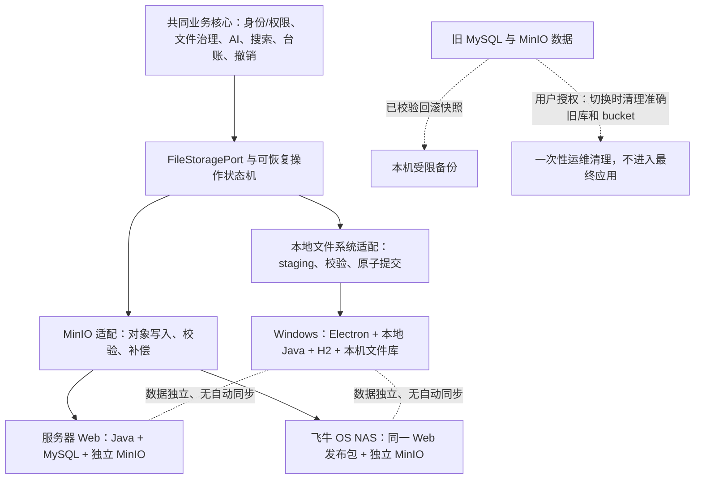
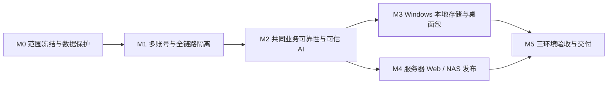

# AgentFS Nexus 最终落地执行计划

> 版本：2026-10-10 · R30–R35 本环境阶段已收口；R40–R42 实现、Docker 本地隔离演练与 Web 离机密文回读通过，Web 源码基线 `4bba6ad` 与 Windows CI 修复 `90f37da` 已推送；真实授权、目标服务器、NAS 实机及三环境发布门禁仍开放。R34 外机脚本交付，R35 桌面独立介质验收按用户要求暂不执行；存储决策沿用 2026-09-26 修订。适用目标：Windows 桌面版、服务器 Web 版和 NAS 版均交付；三种安装实例各自保存独立数据；每个实例支持多账号及管理员/普通用户隔离。用户已确认“重新分析后正式标签集合”问题解决，它只保留为发布回归用例。
>
> 本文替代旧的 C17–C20 线性收尾顺序和 C21–C26 桌面实施顺序，保留 C01–C16 已实现的业务成果。M0 证据见[盘点与保护记录](./M0-存量数据盘点与保护记录.md)，产品合同见[ADR-001](../decisions/ADR-001-最终产品合同与存储架构.md)，需求追踪见[需求追踪矩阵](./需求追踪矩阵.md)，选题材料口径见[范围变更说明](../product/选题报告范围变更说明.md)。M0 的清理步骤只在维护窗口执行；本文档更新本身不删除线上旧数据。
>
> **工作区重叠标注说明：**“已有重叠实现”表示当前代码可复用、不要重复搭建；若同时标出“尚未完成”，则对应验收和缺失能力仍须按该任务完成判据处理，不能据此关闭任务。

## 当前执行状态（2026-10-10）

- **共同核心**：R20–R25 按用户 2026-10-03 确认的阶段范围收口，R26 于 2026-10-04 完成。M1 的应用授权/隔离实现及本机回归已有证据；R02/R11 的旧库维护窗口清理、MySQL 新建/升级矩阵与三环境授权验收仍是开放交付门禁，不因后续研发完成而自动关闭。
- **M3 已完成的本机阶段**：R30 桌面生产 Profile/数据库记忆/目录绑定、R31 安全导入/路径确认/根目录重绑定、R32 本地治理/撤销/恢复与 R33 工作副本编辑/冲突均已实现并完成本机验收。证据分别见 [R30](./R30-桌面生产Profile与数据目录验收.md)、[R31](./R31-本地安全导入验收.md)、[R32](./R32-本地治理撤销与恢复验收.md)、[R33](./R33-工作副本编辑与冲突验收.md)。
- **R35 本环境完成，M3 交付门禁仍开放。** R34 已交付 Electron/Vue/后端/兼容 JRE 安装包及外机验收脚本，本机真实安装、双账号核心闭环、令牌/IPC 隔离、单实例、后台/父进程强杀、更新和卸载保留已验证。R35 已实现一致性整套加密备份、两用户/中文文件/未完成操作恢复、升级失败回滚及独立 JVM 中断恢复，证据见 [R35](./R35-桌面备份恢复与升级验收.md)。用户明确选择先交付 R34 外机脚本，并因暂无独立介质暂不执行 R35 该项验收；不能将本环境结果替代这些门禁。Web 的离机副本不关闭桌面独立介质门禁。
- **R40–R42 实现与本地隔离验收已完成，M4 尚未退出。** 静态 Vue/HTTPS 代理、后端与 MySQL/mc 镜像、版本化 Compose、私网/持久卷/最小权限账号、TLS、安全和容量、持久维护屏障、整套加密备份/恢复/失败升级回滚均已交付；真实 Docker 验证 Redis 降级/删除重建、必需存储故障 readiness 和整栈重启。离机密文已写入独立私有 GitHub 仓库并完整下载校验。详见[生产发布说明](../../deploy/README.md)、[当前验证记录](../../deploy/VERIFICATION.md)及下方任务状态。
- **下一执行阶段**：Windows 安装包 CI 阻断已由 `90f37da` 修复；取得真实 AIStor 授权/支持与安全审查，完成目标服务器验收；同时冻结 R43 飞牛 OS 实机配置并落实独立恢复目标/离线口令保管，再进入 NAS 实机和 R50–R54 三环境验收。R40–R42 已交付能力直接复用；独立目标服务器、NAS、外网边界和峰值容量证据仍须实测。

### 当前可核验的证据

- 截至 2026-10-09 的桌面/共同核心后端报告汇总为 **460 项、0 失败、0 错误、9 跳过**。其中 7 项真实 MinIO 合同用例当时未启用，2 项符号链接用例受本机创建权限限制；本次 Docker 部署验收不能直接改写这些 JUnit 用例状态。真实 Windows junction、不可写 ACL、C→D 跨盘复制及打包解析子进程已执行。各阶段定向报告可能重叠，不将其数量简单相加为新的全量总数。
- R32 的 **14 个独立 JVM 强杀/重启边界全部通过**：归档 6 处、撤销 5 处、删除 3 处。恢复后通过真实 HTTP 登录和带 revision 的鉴权文件 API 核对原正文；两个“复制未记账”边界保留双方并进入冲突/人工处理，没有推断成功。
- R33 的 9 个独立 JVM 强杀/重启边界、真实 Word DOCX 占用/未保存强杀/恢复提交，以及浏览器路径确认/模型授权/冲突/另存/放弃流程通过。工作副本和原件有独立路径，应用崩溃和未确认退出进入可见台账。
- 桌面后端在隔离数据目录中使用 H2、本地正文和数据库记忆；Redis/MinIO 指向不可达地址仍能启动、读取已有文件及恢复已确认治理。默认数据目录与安装目录分开，同一数据目录/正文库有进程锁，缺失数据库/库/密钥不会创建替代空库。
- OpenAPI 类型已从隔离内存 H2 后端生成；前端类型检查、生产构建和无头 Edge 导入路径确认交互通过。R30/R31 验收记录中的较早测试数量保留为各阶段当时的证据，当前数量以本节为准。
- 当前 desktop JAR 位于 `backend/target/desktop/`，与服务器 JAR 输出分离；MinIO SDK、服务端适配器/配置/桶初始化/探测类条目为 0。CI 已增加 desktop 构建/产物检查定义；本地构建成功不代表新增 GitHub hosted job 已运行成功，远端执行结果仍须单独核验。
- R34 本机实际 NSIS 安装后的核心 E2E、程序替换/数据不变与卸载保留已通过，Node 安全测试 3 项及新增后端 8 项通过；454 项全量 verify 后再定向复验原生目录保护。安装包和外机验收脚本本地交付，CI 只构建/校验，未启用远程产物上传。
- R35 的整套加密包读回、新目录恢复、缺少原密钥/正文拒绝、V40→V41 升级及部分迁移后新 JVM 恢复通过；打包 Electron 管理员面板和启动页恢复均调用实际捆绑 JRE。C:/D: 同属一块物理 SSD，标准独立备份明确拒绝；本机快照结果明确为 `independent=false`。
- R35 最终本地安装包为 `desktop/dist/Coffer-0.2.0-windows-x64-setup.exe`（244,972,088 字节），SHA-256 `04fbd7915665dd5a65c0aae57d1f1bdbb874b6e2c84cab413644443e8aed8e56`；320 项捆绑资源实际安装后校验通过。未签名；同目录提供校验清单、离线备份工具和 R34 外机验收脚本。
- 2026-10-10 Web 补充：Web/M1/R23 101 项、导出容量相关 28 项定向回归通过；Java 恢复证明 4 项、Linux 归档/GPG/配置/屏障/容量 7 项及生产 Compose 8 项拒绝边界检查通过。Vue 静态生产构建和最终后端镜像构建通过。具体报告见[验证记录](../../deploy/VERIFICATION.md)，这些数量不与前述 460 项合计。
- 真实 Docker Desktop Linux/amd64 的 `coffer_r43_source` / `coffer_r43_restored` 使用独立卷、无宿主发布端口；经有效主机名校验的 HTTPS 验证 A/B/管理员授权、私有 bucket/子密钥、卷权限、数据库 TLS/DDL 拒绝、Redis 故障和整栈重启。小配额返回可解释 413 且不增加用量；暴力登录返回 429/Retry-After。对象服务由固定源码构建的归档社区 MinIO 提供，仅作为参考兼容性演练，生产仍使用受支持 AIStor 的真实授权门禁。
- Web 一致恢复点含 47 张表、两账号的 2 份文件/2 个对象版本、32 条加密模型凭据及全部服务密钥/PKI/配置/精确镜像。SHA-256、所有权、台账和密钥一致，恢复后撤销 SQL 会话、失效向量标记并重建 Redis。HTTPS 双账号恢复 RTO **141.597 秒**；真实 Flyway V44 提交部分 DDL 后失败，整套快照回滚 RTO **142.784 秒**。升级持续停写，无已接受写入丢失，升级 RPO **0**；失败时恢复点年龄 **63.922 秒**。这些是小样本测量，不是目标 NAS 性能承诺或日常备份 RPO。
- 732,317,297 字节 GPG 密文已由独立 GitHub 凭据写入[私有离机 release](https://github.com/whiteCQian/coffer-encrypted-backups/releases/tag/checkpoint-1bb804e5-7dbb-48f6-b479-642dec5a779a)，整包下载 SHA-256 与本地一致。恢复口令未上传，暂存于本地受限 ACL 目录，仍须独立离线保管。临时 Docker socket 运维容器已停止并移除，两个隔离栈已停止，失败卷/备份保留。详细证明在被 Git 忽略的 `deploy/evidence/` 与 `deploy/backups/*.offhost.json`；公开提交只包含工具和脱敏总结。
- Web 源码基线已推送：[4bba6ad](https://github.com/whiteCQian/Coffer/commit/4bba6ad431eb8031ba5b66f2eb1cca305f19d55b)。该提交及计划提交 `9c2f52d` 的 Windows 安装包 job 曾因 Electron 二进制未初始化失败；根因和修复见[问题报告](./Windows安装包CI问题报告-2026-10-10.md)。修复提交 [90f37da](https://github.com/whiteCQian/Coffer/commit/90f37da51ae903b1c5727748054972bda879ee75) 的 [完整 ci](https://github.com/whiteCQian/Coffer/actions/runs/38061297300)（后端、前端、desktop 分发、Windows 安装包）及 [production-build](https://github.com/whiteCQian/Coffer/actions/runs/38061297396) 均成功。CI 已生成并校验 0.2.1/V43 的 NSIS 包和 320 项资源，该构建阻断关闭；分支保护与剩余增强门禁仍须核对。
- 本机证据不包含另一台干净 Windows 的 Electron/JRE 安装、独立介质实际备份读回、真实硬件断电或 NAS 实机。不得通过勾选最终发布清单抹去这些差异。

### 当前保留的交付门禁

1. **R02/R11**：旧 agentfs 业务库/bucket 的停写、清理 dry-run、准确范围核对、维护窗口切换及新账号空库初始化；本轮没有执行清理或删除旧数据。
2. **R34 外机验收 / R35 独立介质**：安装包与原生桥已交付，本机安装/更新/卸载、整套加密恢复和失败升级回滚通过；另一台干净 Windows 的完整 UI 闭环仍待执行。R35 恢复验收按用户要求在本环境完成；独立介质实际写入/读回因暂无设备按用户要求暂不执行，仍保留门禁。
   原 `4bba6ad`/`9c2f52d` 的 Windows hosted 构建失败已由 `90f37da` 修复并全 CI 通过。新 0.2.1/V43 包已在 runner 构建/校验，旧 0.2.0/V41 包仍保留其本机历史证据；新包签名及独立干净 Windows 运行验收不随构建通过自动关闭。
3. **R40–R42 目标生产验收 / R43 NAS 实机**：生产构建、部署工具及本地隔离演练已通过；真实 AIStor 授权/支持、完整 SBOM/CVE/第三方许可证审查、独立服务器安装/恢复、真实域名 HTTPS、非可信网络 IPv4/IPv6 边界、目标容量/并发及 NAS 实机仍待证据。恢复口令必须在主机丢失时可独立取得；Web 离机密文回读已通过，不再列为未实现。
4. **R50–R54**：三身份 × 三环境完整业务/越权/故障矩阵、真实性能与隐私检查、文档/需求矩阵同步、版本与产物摘要冻结及第三人复现。较早需求追踪矩阵和项目总览中的实现状态仍须随 R53 同步，不作为当前任务已完成或未完成的单独判据。

## 0. 最终交付的定义

交付的是**一套共享业务核心、两种正式存储适配器、三种经过环境验收的部署形态**：

```mermaid
flowchart TB
  CORE[共同业务核心：身份/权限、文件治理、AI、搜索、台账、撤销] --> PORT[FileStoragePort 与可恢复操作状态机]
  PORT --> FS[本地文件系统适配：staging、校验、原子提交]
  PORT --> S3[MinIO 适配：对象写入、校验、补偿]
  FS --> WIN[Windows：Electron + 本地 Java + H2 + 本机文件库]
  S3 --> WEB[服务器 Web：Java + MySQL + 独立 MinIO]
  S3 --> NAS[飞牛 OS NAS：同一 Web 发布包 + 独立 MinIO]
  OLD[旧 MySQL 与 MinIO 数据] -. 已校验回滚快照 .-> SNAP[本机受限备份]
  OLD -. 用户授权：切换时清理准确旧库和 bucket .-> PURGE[一次性运维清理，不进入最终应用]
  WIN -. 数据独立、无自动同步 .- WEB
  WIN -. 数据独立、无自动同步 .- NAS
```

- **所有形态的共同能力**：多账号登录与隔离、文件导入/解析、AI 建议、预览编辑、确认归档、操作台账、单项/批次撤销、检索与真实来源引用、模型 API/本地模式、敏感内容提示、失败重试与恢复。
- **Windows**：本地文件库是文件正文的唯一权威存储；H2 使用独立生产 Profile；Electron 只承担窗口和本地服务生命周期。无需用户安装 JDK、Node、MySQL、MinIO。断网或模型不可用时，已有文件仍可读取和人工管理。
- **服务器 Web / NAS**：MySQL 保存正式元数据，MinIO 保存文件正文；每个安装实例使用独立数据库、bucket、凭据和持久卷。前端使用生产静态资源，后端与 MinIO 由容器/服务管理；两者使用同一套发布包，在服务器与飞牛 OS 实机分别验收。
- **账号**：管理员只管理账号与非内容型系统设置，默认不得通过应用查看普通用户的正文、文件名、摘要、标签、预览、台账、检索结果、引用、聊天与内容日志。普通用户只能访问自己的资源；不提供公开注册和用户间共享。
- **威胁边界**：上述“管理员不可读”指应用角色权限。拥有主机、数据库、备份或 Windows 文件系统权限的运维人员属于可信基础设施边界；若未来要求连宿主机管理员也无法读正文，应另立用户持钥加密项目，不可用现有明文解析架构承诺。
- **明确不交付**：桌面/Web/NAS 自动同步、协作共享空间、多实例同时写一个库、音视频分析、完整 DLP、Web 正文在线编辑、macOS/Linux 桌面包。

### 对原设计作出的更改

1. **单用户改为多账号。** 最新选题报告和本次确定的目标优先于旧 C01“无登录”定义；身份与隔离必须先于桌面存储和公开部署完成。
2. **仅桌面版移除 MinIO，Web/NAS 保留。** 桌面使用本地受控文件库，安装包和运行 Profile 不含 MinIO 服务、SDK 或凭据；Web/NAS 通过同一 FileStoragePort 的 MinIO 适配器保存正文，分别使用独立 bucket、持久卷和备份。官方开源仓库已归档为只读，参见[官方仓库](https://github.com/minio/minio)；R40 发布前必须落实可维护版本、更新渠道、漏洞处置与替换预案，不能直接沿用本机旧二进制。旧单用户数据不迁移；切换前快照与核验，维护窗口清理准确旧库和 bucket。
3. **导入默认复制。** 先将源文件复制到 staging、校验 SHA-256、完成登记，再让用户选择是否删除外部原件。跨卷“移动”不具备可靠原子性，不能作为默认无损导入动作。
4. **目标名称在预览中固定。** `000`–`FFF` 序号可用于分配候选路径，但最终路径必须在预览页展示；确认时锁定并复核。发生冲突时阻塞，不在确认后静默改名或覆盖。
5. **撤销恢复完整正式状态。** R22/R32 当前台账已保存归档前后的正式名称、路径、分类、摘要、标签状态/备注、revision 和正文指纹；撤销按版本完整恢复，并使派生索引失效/进入重建流程。可选向量索引与三部署检索一致性的目标环境验证仍归 R50/R51，不再按“仅恢复路径、名称和分类”的旧实现安排重复开发。
6. **把成功定义为数据库与正文的可核对状态。** 上传、分析、归档、撤销和删除都使用持久操作/任务记录、幂等键与启动恢复，不再仅依赖提交后的内存事件或“失败只记日志”。

## 1. 执行原则与依赖

每项任务在合并前附上：代码/迁移、自动化用例、人工验收步骤、失败处理和文档更新。每个里程碑结束时保存可运行产物、数据库版本、接口契约、回归结果和未关闭风险。C19 测试与 C20 文档贯穿所有阶段，不留到最后一周集中补。

```mermaid
flowchart LR
  M0[M0 范围冻结与数据保护] --> M1[M1 多账号与全链路隔离]
  M1 --> M2[M2 共同业务可靠性与可信 AI]
  M2 --> M3[M3 Windows 本地存储与桌面包]
  M2 --> M4[M4 服务器 Web / NAS 发布]
  M3 --> M5[M5 三环境验收与交付]
  M4 --> M5
```

### M0：统一产品合同并保护存量数据

**R00｜建立唯一验收基线。**

- 已为旧 C01 验收标准、C01–C16 交接/领域模型、C17–C26 清单、部署方案和代码 Wiki 增加历史范围提示；选题报告另附范围变更说明。需求到决定、实现、自动/人工验收及证据的追踪表见[需求追踪矩阵](./需求追踪矩阵.md)，后续每项实现须持续填写真实结果。
- 将 ISSUE-001 记录为“用户确认已解决（2026-09-25）”，保留标签集合替换回归，不再安排重复排障。
- **完成判据**：任一用户可见行为只有一份有效定义；旧文档的冲突有明确废止或修订记录。若选题报告已正式提交，先完成其变更/说明材料，再使用新架构作为答辩标准。

**R01｜冻结权限、数据与失败语义。**

- 已形成 ADR-001，冻结管理员/普通用户权限边界、私有派生数据、旧单用户数据不迁移、模型授权、三实例数据独立、桌面本地文件库与 Web/NAS MinIO、路径冲突和失败语义。
- 已确认 NAS 操作系统为飞牛 OS；当前不虚构具体型号和资源数值。R43 在选定实机后冻结型号/架构/文件系统/卷权限和实际部署基线；R52 在目标硬件基准后冻结最低 CPU/内存/磁盘、文件数量/容量、并发账号和 RPO/RTO。不得拿模拟器或临时容器代替最终实机验收。
- **完成判据**：当前产品、身份、数据权威、威胁和失败合同均无悬而未决矛盾；每个硬件/容量未知值都有责任项和 R43/R52 冻结门槛。硬件细节不阻塞 R10–R26 的业务核心工作。

**R02｜盘点、备份和旧数据归属。**

- 盘点当前 MySQL/H2、MinIO 对象、标签、预览、台账、模型密钥、Redis 可重建数据与历史 UUID 对象；记录数量、引用关系和正文 SHA-256。完成的快照和恢复核对见 M0 记录。
- 用户已决定不迁移旧单用户业务数据，可在新实例切换维护窗口中清理旧业务表和旧 bucket。清理前仍要冻结写入、二次校验快照、导出清理范围和摘要；只删除旧 schema 中 Flyway 以外的业务行与确切 agentfs-bucket，不删除 schema、Flyway 历史、其他 bucket、工作区 H2/Redis 文件或唯一回滚备份。不得把本机开发数据库误当成生产清理目标。
- 现存快照中 2 条文件正文引用缺失、14 条历史归档明细的源/目标对象均缺失、92 个对象是未引用候选；旧业务清理前必须导出这些异常摘要。它们不迁移、不被静默修复。
- **完成判据**：MySQL 与 MinIO 隔离恢复证据和摘要校验完成；用户确认的旧业务数据清理范围可复现、可回滚；剩余备份保留到新系统验收与约定保留期结束。

**R03｜搭建持续验收骨架。**

- 基础 CI 已连接用户指定的 GitHub 仓库 `https://github.com/whiteCQian/Coffer.git`。工作流为后端运行 Maven `verify`（使用隔离 Redis 8 与 Adobe S3Mock 5.2.2），前端执行 `npm ci` 和生产构建；提交 `b4cafb2` 的后端与前端 job 均成功，见[GitHub Actions 运行记录](https://github.com/whiteCQian/Coffer/actions/runs/36127838415)。
- **当前增量（2026-10-10）**：desktop JAR/服务端类排除、生产镜像构建与 Windows NSIS 构建均已得到 `90f37da` 的远端成功证据：[ci](https://github.com/whiteCQian/Coffer/actions/runs/38061297300)、[production-build](https://github.com/whiteCQian/Coffer/actions/runs/38061297396)。Electron 锁定包内安装器在首次无二进制目录时显式准备 Windows x64，7 项 Shell/准备回归通过，版本/架构/资源和最终安装包摘要均核验。当前安装包构建阻断已关闭；分支保护、迁移/OpenAPI/漏洞扫描等增强门禁仍按原要求完善，构建 job 不提供目标授权、NAS 或真实灾备验收证据。
- 基础门禁已完成。后续仍须补齐 OpenAPI 生成差异检查、依赖漏洞扫描、H2/MySQL 迁移升级矩阵，以及本地文件系统和 MinIO 两种适配器的故障注入；Redis 按可选/可重建依赖测试。OpenAPI job 应在接口契约生成稳定且无需外部服务后加入。将成功运行设为 M1 及后续阶段的合并门禁，并在分支保护中强制要求两个基础 job。
- **完成判据**：基础后端、前端各有成功 hosted run（已满足）；增强门禁随对应迁移、契约和故障用例实施，并在其任务验收前成为必须通过的 CI job。

### M1：多账号、身份和全链路数据隔离（所有后续工作的前置门禁）

**R10｜账号与会话。依赖 R01。**

- 增加首次管理员初始化、管理员建用户/停用用户/重置凭据、用户登录/退出/改密、会话过期与强制撤销。采用服务端会话与受保护 Cookie，写接口防 CSRF；对登录、密码重置与模型测试设置速率限制。禁用公开注册。
- 使用数据库持久化服务端会话（H2/MySQL；Redis 不作为登录可用性的前提）；设置 HttpOnly、Secure、SameSite Cookie、CSRF、防会话固定、过期与主动撤销。密码使用成熟自适应哈希保存，绝不存明文或可逆密码。
- 记录最小化账号审计：谁在何时创建/停用账号、重置凭据、修改全局设置；审计中不出现私有文件内容。
- **本轮重做与验收（2026-09-26）**：完成首次管理员初始化、登录/登出/改密、管理员创建/停用/启用/重置普通用户、账号审计、JDBC 持久化会话、密码哈希、CSRF、会话撤销和限流；初始管理员由一次性 `COFFER_ADMIN_SETUP_TOKEN` 建立。后端真实安全过滤链/会话/账号授权集成测试通过；同一无头 Edge 窗口完成 Alice、Bob、管理员切换的页面隔离验收（前端使用受控 API）。桌面浏览器与真实后端联跑、部署配置矩阵仍归 R51/R53。
- **完成判据**：三种身份（管理员、用户 A、用户 B）可完整走通页面；停用/退出后旧会话失效；直接调用 API 与页面规则一致。

**R11｜所有权模型与存量迁移。依赖 R02、R10。**

- 自 Flyway V15 起增量增加 `app_user`、个人工作空间和必要的 `owner_id`：文件、标签字典及映射、任务、收件箱记录、预览、归档批次/明细、补偿、聊天、模型日志、模型端点/密钥、向量任务、归档名称保留。归档名称唯一键包含 owner；标签名字典与关系改为用户范围。
- 本项目不做旧匿名数据 owner 回填。R02 已获用户明确授权清除旧业务数据；上线切换必须先停止旧服务写入、完成可恢复快照和行数/对象摘要，然后只清空旧 agentfs schema 的业务行与准确的 agentfs-bucket，保留 Flyway schema/迁移历史及回滚备份，再升级到有 owner 约束的新 schema 并初始化管理员。清理脚本 dry-run 必须列出库名、表数/行数、bucket 名/对象数和备份指纹；检查通过后才可确认执行。H2/MySQL 两套迁移脚本一致；开发机备份与其他数据不得被部署清理脚本误选。
- **本轮重做与验收（2026-09-26）**：H2 上验证 V1–V21 迁移；本机 MySQL 已对现有库实际启动并执行 V16–V21，修复 V16 对 Hibernate 物理索引名的依赖。迁移保留了旧业务行，旧行仍为 `owner_id IS NULL`，不会自动交给管理员。**仍未完成**清理 dry-run、可恢复快照/摘要和维护窗口切换；本次没有删除任何数据库行或对象，因此不能关闭 R11 或 M1。
- **完成判据**：全新/已清空实例升级后所有新增业务资源必须具有有效 owner；旧数据清理的行数、对象数、摘要与快照可核对、可恢复；初始化后没有无 owner 数据，不把任何旧资源隐式归给管理员。

**R12｜服务层与后台任务授权。依赖 R11。**

- 所有按 `fileId`、`taskId`、`previewId`、`batchId`、`sessionId`、对象路径查询或修改的入口，都从服务端认证主体解析 owner；Repository 查询带 owner 条件。后台任务把 owner 与操作意图持久化，不能依赖请求线程的 ThreadLocal。
- 管理员接口只返回账号与聚合运行状态；文件名、摘要、标签、路径、台账明细、补偿错误、导出和日志视为私有数据。跨用户资源返回统一的不可枚举错误语义。
- **本轮重写完成（2026-09-26）**：服务层校验启用普通用户，Spring Data Repository 工厂统一拦截私有数据调用，主键读写显式核对 owner，原生 owner 参数不可伪造；对象存储校验 owner 路径与固定 bucket。持久任务/事件携带 owner，启动恢复重读持久意图，定时任务逐启用普通账号执行。管理员私有 API 返回 403，只开放账号管理与数字型运行汇总。R10 服务角色授权与 R11 凭据主键一并修正。R12 专项 49 项通过；本轮全量后端回归 275 项通过（0 失败、0 错误）。MySQL 全新库/升级库矩阵、旧数据清理和 R51 三环境故障矩阵仍待完成。详见 [R12 授权验收记录](./R12-服务层与后台任务授权验收.md)。
- **完成判据**：猜测另一用户的 ID、路径、导出链接或后台任务 ID 均不能读/改/重试；管理员也不能通过这些入口看到用户内容。

**R13｜搜索、Agent、记忆和引用隔离。依赖 R12。**

- 将 owner 显式传入 `FileSearchTool`、`FileParsingTool`、最近上传、`HybridSearchService` 的词法/标签/向量两路，以及异步检索线程；**在结果送入模型前**按 owner 过滤。Redis 键、向量 generation 和聊天 session 归属均包含/校验 owner；引用点击时再次检查授权和文件版本。
- 对管理员禁止通过自然语言工具间接搜索用户文件；模型产生的文件 ID 不可作为授权凭据。
- **本轮推翻并重写（2026-09-26）**：Agent 每轮工具由服务端绑定 owner/session；关键词、标签、最近上传、混合检索两路及降级结果均按 owner 约束后才进入模型。新增持久 owner 会话、owner 分区的 Redis 记忆和向量 generation；旧记忆在文件删除或版本变化后失效，引用携带 revision 并在读取时重新鉴权。双用户/管理员、会话猜测、恶意向量 ID、向量降级、记忆复用和历史引用交叉等自动验收 79 项通过；全量后端回归 275 项通过。真实 Redis/MinIO 故障、桌面/NAS 和多实例会话锁仍归 R51/R50。详见 [R13 搜索、Agent、记忆与引用隔离验收](./R13-搜索Agent记忆与引用隔离验收.md)。
- **完成判据**：A/B 两账号和管理员的关键词、向量降级、最近上传、`parse_file`、会话 ID 猜测和历史引用交叉测试均无跨用户结果或内容进入模型上下文。

**R14｜模型配置与内容日志隔离。依赖 R10、R12。**

- 当前全局 API/本地模型模式和端点改为用户作用域，或采用管理员公布的受限端点清单且由用户明确确认。任务记录配置版本、模式、端点标识；配置改变不改变运行中任务，更不能由管理员静默改写用户正文去向。
- 默认关闭请求/响应正文日志；`model_call_log` 仅保留必要的用量和错误分类，定义保留、删除和用户查看规则。加密主密钥与用户 API Key 分层管理。限制端点 URL 的协议、主机/内网访问和重定向，防止模型测试成为内网探测入口。
- **本轮重写并验收（2026-09-26）**：用户逐任务确认模型目标；服务端生成 owner 绑定的不可变目标/密钥快照；异步提交固定配置版本；受限 URL 与重定向阻断；默认关闭正文日志并隔离/限期删除个人诊断。用户可查看目标并删除自己的诊断。专项 15 项和全量后端回归 275 项通过；前端类型检查与生产构建通过。真实外部模型、DNS/IP 钉扎、主密钥轮换演练和三环境标记扫描仍待环境门禁。详见 [R14 模型目标与内容日志隔离验收](./R14-模型目标与内容日志隔离验收.md)。
- **完成判据**：用户能在提交 AI 任务前识别内容将发送到哪个端点；注入带标记的正文/密钥后，应用日志、错误响应和管理员视图都找不到标记。

**R15｜登录、管理员和隐私页面。依赖 R10–R14。**

- 前端增加登录、首次初始化、账号管理、无权访问、会话失效、用户模型设置和私有数据删除/导出交互；移除“本地单用户”文案。全局 UI 状态在切换账号/退出时清空，禁止把上一用户的文件、引用或缓存展示给下一用户。
- **本轮重写并验收（2026-09-26）**：实现登录/首次初始化、独立管理员控制台、会话失效与身份切换隔离、无权访问页、用户模型隐私、个人数据导出/删除和清理队列状态。后端隐私集成 3 项通过；同一无头 Edge 窗口按 Alice→Bob→Alice→管理员→Bob 验证迟到响应、路由和页面状态隔离。真实后端和前端已通过一键启动健康检查（MySQL Flyway V16–V21、后端健康、前端 HTTP 200）。桌面壳和三环境发布验收仍待 R50–R53。详见 [R15 登录、管理员和隐私页面验收](./R15-登录管理员与隐私页面验收.md)。
- **完成判据**：三种身份在同一浏览器和桌面窗口轮流登录时不串页面状态；管理员页面无私有文件入口和数据回显。

**M1 退出门槛：**双用户 + 管理员越权矩阵全通过；越权读取/修改/模型上下文泄露次数为 0。未过此门槛，不进入对外部署或桌面打包。

**当前解释：**已有应用层本机隔离证据用于继续隔离研发与测试 JAR 构建；它不表示 R11 旧数据维护切换、三环境授权矩阵或正式桌面发布包验收完成。未完成的上线门禁继续保留，不执行对外部署。

### M2：共同业务可靠性、文件访问和可信 AI

**R20｜统一存储端口、路径与文件身份。依赖 M1。**

- 定义 FileStoragePort 的写入、范围读取、stat、SHA-256、复制/移动、删除、no-overwrite 和冲突检查；桌面由本地文件系统适配器负责，Web/NAS 由 MinIO 适配器负责。上传、解析、预览、归档、撤销和文件访问只依赖端口。MinIO SDK、MinioClient 与 BucketInitializer 仅留在服务端适配及 Web/NAS 配置中；构建时将该适配器及 SDK 排除出桌面发布包，桌面运行 Profile 不创建 MinIO Bean，也不启动或连接 MinIO。业务记录保存 owner、逻辑路径、内容指纹和 revision，不存桌面绝对路径或服务端 bucket 凭据。
- 桌面文件根目录由用户数据目录绑定；按 owner 隔离逻辑命名空间。统一逻辑路径规范，并在本地适配器处理 Windows 大小写、Unicode、尾点/空格、设备名、路径穿越、符号链接和连接点；检查规范化后的实际路径始终在配置根目录内。MinIO 适配器校验 bucket/key 的 owner 映射，不直接接受客户端对象 key。
- 桌面文件写入采用同卷 staging、长度/摘要校验、flush/持久化与原子 rename；跨卷移动拆成持久化的 copy-verify-commit-cleanup 流程。Web/NAS 对象写入、复制和删除使用内容校验、幂等步骤与补偿任务；不能把对象操作宣称为 SQL 原子事务。NAS 在飞牛 OS 实机验证 MinIO 容器与持久卷，不承诺 NFS/SMB 多主写或集群共享写入。
- 不保留旧单用户 MinIO Key 的应用内兼容读取；旧数据由 R02 清理，不迁入新 owner。新 Web/NAS 初始化独立 bucket。过渡版本不能在旧对象尚未完成备份/清理前发布。
- **2026-10-01 实施进展**：上传、解析、预览、治理与清理已接入统一 `FileStoragePort`；本地适配器校验 owner、路径、保留名和链接，写入经过同卷暂存、摘要校验、落盘与原子发布；真实 Windows Junction 父目录的逃逸写入测试通过。MinIO 适配器校验 owner key，并实现条件写入、Range、复制/移动和摘要删除。`stat` 对实际对象字节重新计算 SHA-256 和长度，不能只信任可过期的对象元数据；元数据与正文不符进入冲突。干净 `desktop` Profile 打包后已核对 JAR 不含 MinIO SDK、适配器或配置类，并在隔离 H2 用户目录启动，健康检查为 UP、首次初始化状态可读；服务端构建保留 MinIO。隔离的真实 MinIO 实例通过双 owner、冲突不覆盖、范围读取和摘要校验测试；飞牛 OS 容器及持久卷仍需目标机器验收。
- **完成判据**：三种部署均只能经鉴权接口读取正文；两个不同 owner 可有同名文件，同一 owner 的目标冲突不覆盖；恶意路径/链接/对象 key 不能越权；断电/进程强杀后操作可恢复或进入人工处理态。

**R21｜持久化文件操作与处理任务。依赖 R20。**

- 为上传、导入、归档、撤销、重命名、删除、工作副本保存建立持久操作意图、步骤状态、幂等键、任务租约、退避重试、上限与人工处理态；执行前写意图，文件 I/O 后更新状态，启动时扫描恢复。修复上传提交失败留孤儿、数据库删除后正文清理失败只记日志、AFTER_COMMIT 内存事件丢失造成的 PENDING 悬挂。
- 分别做数据库与桌面文件库、数据库与 Web/NAS MinIO 对账：无引用文件或对象先隔离并按保留期处理，缺失正文进入可见异常，不自动把台账标成功。删除采用逻辑不可见与持久物理清理任务，定义备份保留与最终删除时间。
- **2026-10-01 实施进展**：上传/收件箱导入、重命名、归档/撤销、删除及工作副本保存均有持久意图或台账；上传和工作副本使用客户端幂等键，后台任务有租约、退避和恢复扫描。收件箱导入、写入意图恢复、重命名、工作副本保存、物理删除、归档明细和治理补偿的默认执行/失败上限统一为两次；归档明细第二次失败后进入 `MANUAL_REVIEW`，重复触发不会再执行，人工显式重试重新开始有界次数，旧台账中已达上限的失败明细在启动时转换为人工处理态。向量重建必须捕获模型执行快照，后台协调器和快照组件不再可选；缺失或失效快照将已登记的重建任务标为失败，不留在运行态。无引用对象进入私有隔离台账，记录保留截止时间；用户核对 SHA-256 后可登记放弃，到期再按摘要、大小和外部引用清理，保留最终删除记录。已终结路径若重新出现对象，会创建新的人工处理记录而不覆盖历史；并发预约对象路径由 owner 行锁串行化。缺失正文标为可见异常，身份冲突不自动覆盖。操作台账支持逐页查询。桌面与开发环境的文件型 H2 设置 `WRITE_DELAY=0`。`scripts/verify-file-crash-recovery.ps1` 在上传三处、重命名一处、工作副本四处、删除三处、孤儿清理两处、归档六处、撤销五处分别执行 `Runtime.halt` 与全新 JVM 重启，合计 24 处通过；真实断电和 NAS 目标环境仍需演练。
- **完成判据**：在每个持久化步骤后强杀进程、重启，文件未丢失/覆盖/重复归档；每个失败都有可查询的状态和恢复动作，无永久 PENDING。

**R22｜治理与撤销完整性。依赖 R20、R21。**

- **已完成（2026-09-26）：**移除 `TagConfirmedEventListener → StorageArchiveService.archive` 与 `FileOperationService.changeCategory` 的直接归档旁路；旧分类写入路由返回 409，正式位置/分类变更统一走“预览→确认→操作台账”。
- **当前工作区已有重叠实现（2026-09-26，复用）**：确认后的正式标签集合会先清除旧关联、写入确认集合并核对，归档操作持久保存执行状态和补偿意图。
- **2026-09-30 实施进展**：新治理台账保存操作前后正式字段及确认标签快照，包含对象 SHA-256；撤销先校验版本和正文身份，再恢复完整快照并安排检索重建。旧台账缺少快照时显式标为只能部分恢复。补偿任务恢复中断的归档或撤销后会重新计算批次状态。撤销副本通过校验后写入持久标记，重启可继续提交正式元数据；在标记前强退的副本仍进入冲突人工核对，避免仅凭相同字节冒认对象。归档六处和撤销五处持久化边界的独立 JVM 强退/重启已核对对象、正式快照和批次汇总。
- 确认后的正式标签必须与用户确认集合完全一致；该已修复问题保留普通预览、重新分析、失败重试和幂等回归。
- **完成判据**：重复确认/撤销幂等；批次单项失败相互隔离；冲突不覆盖；撤销后数据库、对象和标签/摘要与保存的原快照一致；台账不能在事实不一致时显示成功。

**R23｜受控文件读取与导出。依赖 R12、R20。**

- 新增按身份鉴权的文件流接口，支持浏览器预览/下载、Range、类型和安全响应头；Web/NAS 不再向用户提供默认 7 天 MinIO 预签名 URL，正文由授权接口从 MinIO 流式返回。删除或撤权后旧入口不能继续读取；桌面按相同 API 从本地文件流返回。
- 修复 CSV 导出公式前缀注入，导出仍逐项校验 owner；限制单次导出数量和资源消耗。
- **2026-10-02 实施进展**：统一鉴权正文接口支持完整读取和单段 Range，流来自当前环境的存储端口；读取前必须有有效的文件摘要，且记录的摘要、大小与实际对象一致，否则返回身份冲突而不打开正文流。校验后打开正文时继续绑定已观察到的对象身份：MinIO 对状态计算和后续完整/范围读取使用 ETag 条件请求，本地文件库在同一打开句柄上复核摘要后返回流；对象被替换则在发送正文前进入冲突。治理 CSV 导出对公式前缀做文本转义、限制行数与字节数并逐项验证 owner；隐私 ZIP 导出改为逐行写清单、限制文件数/记录数/未压缩字节数，逐文件核对实际摘要和长度并在导出流中再次计算摘要，失败不会发送带 `EXPORT_COMPLETE` 的归档。跨 owner、失效会话、已删除文件、旧版本 URL、陈旧/缺失文件指纹、校验后对象替换及导出限额已纳入测试；隔离 H2 的真实打包后端健康为 UP，未登录正文请求返回 401。
- **完成判据**：未授权账号和已失效会话无法通过文件 ID、URL 或导出读取内容；以 `= + - @` 开头的文件名在表格中仍作为文本。

**R24｜统一解析结果、来源位置和资源上限。依赖 R13、R20。**

- 定义 `ParsedDocument`/片段结构：fileId、revision、格式、原文片段、来源位置、解析器版本和错误码。TXT 保存行/字符范围，PDF 保存页码，Word 保存段落定位，图片指向原图；聊天引用与建议只能引用真实解析片段。
- 上传、收件箱和桌面导入统一限制文件大小、真实类型、PDF 页数、图像像素、解析时间/内存及损坏/加密文件行为；防 ZIP/Office 解压膨胀与本地符号链接/重解析点逃逸。
- **2026-10-02 实施进展**：统一 `ParsedDocument`/片段持久层，TXT 行和字符、PDF 页、Word 段落及图片原图定位进入引用；解析结果入库前再次核验来源对象的实际摘要与长度，来源变化不写入旧文件版本。上传、导入、检索重建共用签名校验和解析器。已限制输入字节、文本字符、PDF 页、图片像素、Office ZIP 展开与片段数。打包运行时由最多两个独立、限堆内存的解析子进程执行第三方解码；解析器接收到流后的 20 秒时限覆盖排队、读取、子进程执行和结果接收；上游存储状态检查与打开流另有 20 秒限时保护，解析前后阶段分别计时，整条处理链不以 20 秒为总上限。读取卡住时调用方按时返回超限，放弃的输入流异步关闭，工作槽位直到读取线程实际退出才释放，避免无限创建卡住线程。打包后的父子进程协议与 TXT/PDF/WebP/加密及损坏样本、卡住的输入流均已实测。
- **完成判据**：支持格式样本可从引用定位到原文；坏文件、超限文件和不支持格式状态明确，不能生成猜测性摘要/建议；失败不会拖垮进程或丢原件。

**R25｜敏感识别和模型授权。依赖 R14、R24。**

- C17 改为**发送远端模型前**的门禁：文件名/扩展名及本地解析文本规则识别证件、财务、Token、私钥等；默认阻止命中内容发送 API 模式，用户查看目标端点后显式允许本次处理。图片、解析失败等无法在本地判定的正文按“未知”处理，同样需要逐文件明确授权。LOCAL 模式显示本地端点；两种模式都不静默回退。
- 记录谁在何时批准何文件/版本发送至何端点，但审计记录不含正文；文件重新上传或端点改变必须重新判断。
- **2026-10-02 实施进展**：远端提交前依据文件名及本地解析正文判定敏感/未知风险，图片和解析失败默认未知；用户可在文件详情查看能力、模式、目标与风险，再逐文件批准。批准绑定 owner、文件 revision、SHA-256、模型配置版本、端点和能力；聊天搜索结果也经过同一门禁。临时解析来源以已校验对象身份打开，校验后对象替换作为冲突处理，不降格为可批准的“未知”。语义标签联想在发送候选标签名和覆盖文件数前，逐一核对所有关联文件的 CHAT 授权；任一来源未获准即排除该标签，候选集为空时不发起远端请求，本地字面联想仍可用。聊天记忆绑定模型配置版本，目标变更后清除旧记忆；Chat、Vision、Embedding 请求在每次发送前核对当前配置，阻止进行中的旧快照继续发送。上传、治理、解析工具、搜索工具和向量索引的授权组件改为必需依赖；上传及向量重建后台任务缺少模型执行快照即失败，旧模式回退已移除。测试覆盖未授权阻断、缺失快照阻断、授权版本生效、端点改变后的失效、旧记忆清除和标签来源过滤。
- **完成判据**：命中规则且未经确认的样本不会触发远端请求；经确认仅该文件版本可发送；模型失联时文件仍可查看且任务可重试。

**R20–R25 阶段状态：已完成（用户于 2026-10-03 确认按当前阶段收口）**

当前阶段按已实现功能与本地回归结果接受 R20–R25，不再把下列目标环境验证作为这轮开发任务的关闭条件。尚未执行的 NAS 实机、真实断电、三部署端到端验收及本机跳过的符号链接用例仍如实保留，不表示这些场景已通过；发布和目标环境验收时须补齐相应证据。

- **R21｜失败重试上限与人工处理态（2026-10-01 已修复默认策略）**：治理补偿失败保留退避时间，启动重复登记不再重置状态；上传、重命名和工作副本意图的启动扫描立即对账首次中断的步骤，但已有失败次数的意图继续遵守持久退避时间，避免连续重启耗尽次数。上传意图按创建时间从旧到新处理，避免最新项挤占旧项。收件箱导入、写入意图恢复、重命名、工作副本保存、物理删除、归档明细和治理补偿的默认上限为 2 次，达到后停止自动执行或进入人工处理态。运行中断达到补偿上限也进入人工处理态；显式批次重试才重置尝试次数。定向测试覆盖退避、重启、次数上限和显式重试；前端操作台显示人工核对状态。
- **R20/R21｜MinIO 版本化物理删除与历史版本对账（2026-10-02 本地通过）**：真实 MinIO 合同探针发现现有实例对带错误 `If-Match` 的普通删除请求未报错，因此不再把该请求头当成删除保护。新建 bucket 初始化时启用版本控制；适配器在写入和物理删除前核对版本状态，未启用或暂停则拒绝操作，并使服务端存储健康检查报告 DOWN。删除先核对正文 SHA-256，再要求该 key 只有一个带版本 ID 的版本，仅删除该版本并核对不会重新暴露正文；存在历史版本、旧无版本对象或配置冲突则保留并交人工处理。版本清单对账现能发现多版本、旧无版本对象，以及删除标记遮蔽当前正文的 key；异常按 owner 进入持久人工台账，重复扫描不重复建账，管理员处理后可重新扫描并保留已解决历史。操作台显示原因和重扫入口，跨 owner 台账不可见。隔离 bucket 的真实 MinIO 测试覆盖单版删除、多版冲突、删除标记隐藏历史及按旧版本 ID 删除不影响新版本。旧 bucket 不会被静默修改；R02 备份与清理后须切换到新的独立版本化 bucket，目标服务器/NAS 仍需验收。具体历史版本的清理由部署管理员核对执行，系统不会自动删除；独立 liveness/readiness 分组仍归 R26。MinIO 的[版本删除语义](https://min.io/docs/minio/linux/administration/object-management/object-delete.html)见官方文档。
- **R20/R21｜隐藏历史版本防覆写（2026-10-02 本地通过）**：MinIO 的删除标记会让普通对象查询显示 key 不存在，但旧版本仍在。写入前现在核对完整版本清单，发现任何旧版本或删除标记即拒绝复用；写入后核对仅有刚创建的版本。版本化物理删除前核对唯一目标版本，删除后要求该 key 的版本清单为空，不能只凭当前对象不可读判定清理完成。隔离 bucket 的真实 MinIO 用例确认隐藏历史不能被覆写，而相邻前缀的独立 key 可以写入。外部主体在两次检查之间并发操作仍无法由 MinIO 单对象 API 提供跨请求原子性；发现冲突时保留现场并进入已有的人工对账流程，生产部署须限制 bucket 的额外写入者。
- **R24｜上传大小上限统一（2026-10-02 本地通过）**：单文件请求校验、Servlet multipart 限制、后端处理层和前端提示统一为 32MB；multipart 请求总上限设为 34MB，容纳 32MB 文件的表单边界与字段。超限响应也明确写 32MB，避免 32–50MB 文件在请求阶段通过后才于后台失败。
- **R24/R25｜模型输入来源身份绑定（2026-10-02 本地通过）**：上传处理、治理预览、Agent 文件解析及向量补偿读取先核对文件记录的 SHA-256/大小与存储对象一致，再打开绑定到已观察对象身份的流；读取到末尾时重算长度和 SHA-256，同长度但内容不同的流不能进入后续模型请求。没有可验证摘要的旧记录拒绝解析发送，需先按文件身份对账。模型授权门禁在临时解析原文时也使用这一流。单元测试覆盖过期元数据、对象身份绑定和字节篡改；相关业务入口与真实 Redis/MinIO 条件下的全量回归通过。解析前的状态检查与打开流由最多两个工作槽和 20 秒限时保护，图片预读取与前置检查共用 20 秒预算；解析结果入库及模型授权前的状态复核也限时。超时后迟到的流异步关闭，卡住的读取工作线程占用槽位直到实际退出，限制并发卡住读取数。各阶段分别计时，目标环境的慢存储与故障恢复仍需验收。
- **R21｜无引用对象保留与最终处置（2026-09-30 本地通过）**：未知对象和提交后失去文件引用的对象仍先隔离、保持私有；台账记录保留截止时间。用户核对 SHA-256 后可登记放弃，清理器到期再核验对象摘要、大小和其他任务引用；成功记录最终清理时间，失败退避并在第 2 次后进入人工处理。已清理路径重新出现对象会新增台账，保留历史记录。定向测试覆盖保留期、身份变化、引用冲突、重试上限和路径重现；“已登记清理”“已物理删除但未记完成”两处独立 JVM 强退/重启通过。目标 NAS 与真实断电仍需验证。
- **R21/R22｜归档与撤销跨进程崩溃矩阵（2026-09-30 本地通过）**：归档六处、撤销五处持久化边界在隔离桌面 H2/本地库中分别由 `Runtime.halt` 强退，再由新 JVM 核对对象字节、完整快照、台账和批次汇总。复制已发生但成功标记尚未提交时进入可见冲突并保留两个对象；撤销副本经校验且标记已提交时可自动续跑。脚本支持按步骤复验；真实断电及目标 NAS 仍单列验收缺口。
- **R20/R21｜目标环境验收未完成**：隔离的真实 MinIO 测试已通过，但飞牛 OS 上的 MinIO 容器、持久卷、重启/升级/备份恢复及真实断电尚未演练。`WRITE_DELAY=0` 与 JVM 强退测试不能替代硬件断电证据；三种部署的最终完成判据仍需目标机器验证。
- **R23–R25｜部署级端到端证据仍需补齐**：已有鉴权/导出、解析来源与资源上限、模型发送门禁的集成测试及打包解析子进程样本测试；尚未在全部目标部署上以真实浏览器会话和真实模型端点复核撤权后的旧入口、引用回跳、超限解析隔离、授权版本/端点变化后的远端请求阻断。上述是验收缺口，不代表这些场景已发现代码故障。
- **R20–R25｜MySQL 迁移实测（2026-10-01 本地通过）**：在本机 MySQL 8.0 上用新建的随机临时库完整执行 V1–V35；另一个临时库先执行至 V21，写入一条旧版文件元数据，再执行 V22–V35，确认 35 条迁移记录均成功且旧行大小、空 owner 与空内容摘要保持不变。探针结束后清理临时库。此验证不等于对现有生产库或 NAS 数据执行过升级恢复演练。
- **历史回归状态（2026-10-02）**：按项目本地配置启动 Redis 8 与 MinIO，在真实依赖及最新打包解析 JAR 可用的条件下，后端全量 388 项、0 失败、0 错误、2 项跳过；另补测历史版本异常台账的跨 owner 不可见。Redis 向量存储、真实 MinIO 合同、独立解析子进程、标签来源授权查询、端点变更后的记忆隔离、已领取上传任务的模型快照失效立即失败，以及两次失败后的人工处理边界均通过。本轮修复了 MinIO 范围读取时对象已消失却返回服务器错误的问题，并覆盖本地/MinIO 在状态检查后发生对象替换时的版本绑定读取、MinIO 版本化删除、隐藏历史版本防覆写、历史版本清单对账及服务端健康检查；真实 MinIO 合同测试已覆盖缺失对象的普通读取、范围读取、对象替换、多版本冲突及删除标记隐藏历史。解析源流卡住的 20 秒总时限及解析入口的来源版本/字节校验新增定向测试。仅本机无符号链接创建能力导致本地文件库与收件箱的符号链接用例各跳过一项；Windows Junction 逃逸用例已通过。前端 `vue-tsc --noEmit -p tsconfig.app.json` 及 Vite 隔离目录生产构建通过；当时 `frontend/dist/assets` 的权限使默认清理旧产物报 `EPERM`；2026-10-08 的正常生产构建已通过，该历史问题不再单列为当前阻塞项。24 处独立 JVM 强退/重启边界在重试状态调整后再次全部通过；启动扫描退避修复后，上传 3 处、重命名 1 处及工作副本 4 处边界又分别通过独立 JVM 强退/重启复验。新一轮 `desktop` 包检查确认无 MinIO SDK、适配器、配置、bucket 初始化及存储健康类；此前隔离 H2 启动健康检查为 UP。目标 NAS、硬件断电及完整部署级 E2E 尚未验收；当前工作区改动未提交。

**R26｜隐私、错误与运行状态收口。依赖 R21–R25。**

- 统一脱敏日志、异常响应、密钥旋转和数据保留；生产关闭调试接口、H2 Console、SQL/请求正文日志。管理员仅看聚合健康与积压，不能通过错误信息、监控标签或文件名泄露用户内容。
- 区分 liveness/readiness；监控任务积压、补偿、数据库连接、桌面文件库或 Web/NAS MinIO 的健康与容量、备份新鲜度。页面显示失败原因与下一步操作，避免“显示成功但事实不一致”。
- **已完成（2026-10-04）**：统一固定事件码日志与 HTTP 错误响应、全库事务密钥轮换、跨 owner 诊断保留、独立调度的有界健康采样、liveness/readiness、数据库连接池/积压/补偿/容量/备份新鲜度监控、聚合告警历史及管理员/普通用户故障页面。完整回归 409 项、0 失败、0 错误、2 项本机符号链接能力跳过；17 项 R26 定向测试、浏览器故障场景、真实生产日志标记扫描和两种构建均通过。配置与验收详见 [R26 验收与运行说明](./R26-隐私错误与运行状态验收.md)。实际备份回执须由真实备份作业提供；未配置的容量/备份显示未核实并告警，不伪造健康。
- **完成判据**：模拟依赖故障时状态/告警/页面一致；敏感标记在日志、指标、错误和管理员视图中均不可检索。

**M2 退出门槛：**本地文件系统适配器与 MinIO 适配器都通过端口合同、两账号治理及故障恢复场景；桌面构建产物无 MinIO SDK、连接或服务依赖，Web/NAS 仅通过受控适配器访问 MinIO；源码中无未受控的直接归档旁路。

**当前阶段状态：**R20–R26 的实现与本机阶段已收口，可供 M3/M4 复用。目标服务器/NAS 的 MinIO/持久卷、真实断电及三部署 E2E 继续列入 R40–R43/R50–R52，当前这轮跳过的 7 项真实 MinIO 用例须在对应运行环境复验。

### M3：Windows 本地文件库与桌面应用

**R30｜桌面生产 Profile 与数据目录。依赖 M2。**

- **实现与本机验收完成（2026-10-08）**：独立单进程 H2/loopback 生产配置、目录进程锁、UUID/格式版本/数据库加密绑定验证、明确的首次空目录初始化、本机受限主密钥与初始化令牌、数据库会话记忆和按 owner 的隐私清理。正常启动使用 `IFEXISTS=TRUE`，缺失目录/数据库/文件库/密钥或绑定冲突均拒绝替代建库；桌面构建单独输出且不包含 MinIO SDK/服务端类。实现与本轮验收边界见 [R30 验收](./R30-桌面生产Profile与数据目录验收.md)；干净机安装包/JRE 与整套备份恢复仍归 R34/R35。

- 建立独立 `desktop` Profile：H2 嵌入式单进程、Flyway validate、关闭 H2 Console/DevTools、后端仅监听 loopback；业务数据与安装目录分离。桌面应用与本地数据库同一进程生命周期，不能沿用开发 `AUTO_SERVER=TRUE` 配置。
- 会话记忆改为数据库实现，Redis 向量作为可选能力；桌面不以 Redis/MinIO 为启动硬依赖。首次初始化生成本机密钥并纳入备份流程；文件库标识包含 UUID/格式版本和绑定校验。
- **完成判据**：干净 Windows 环境上无需预装 MySQL/Redis/MinIO 即可启动基本业务；同一库不能被第二进程误写；缺失根目录/密钥时清楚报错且不自动创建空的新库掩盖旧数据。

**R31｜本地安全导入。依赖 R20、R30。**

- **实现与本机验收完成（2026-10-08）**：owner 五区域和库绑定、实际不可写初始化拒绝、双目录进程锁、显式根目录重绑定/正文摘要核对、受控 owner 收件箱、来源只读锁与快照、导入目标预览确认、同卷 staging 校验发布后登记任务，以及保留原件后的扫描轮转。两账号同名、中文名、来源占用/变化、跨盘、冲突、不可写 ACL 和 Windows junction 均有测试；详见 [R31 验收](./R31-本地安全导入验收.md)。原生文件选择桥与完整加密备份恢复仍归 R34/R35。

- 文件库按 owner 隔离 `inbox/managed/work/quarantine/lost-found`；空目录初始化和根目录重绑定检查。导入先复制到同盘 staging、校验大小/sha256、fsync/安全重命名，再登记任务；跨盘和文件占用失败时源文件仍保留。
- 收件箱扫描明确归属用户，拒绝任意符号链接/连接点越界和不受控目录；同名目标必须按预览中展示的路径确认。
- **完成判据**：目录非空/不可写拒绝初始化；中文名、跨盘、断电、磁盘满、重复文件和两账号同名导入均有可恢复结果；默认不删除外部原件。

**R32｜本地治理、撤销与恢复。依赖 R21、R22、R31。**

- **已实现并完成本机验收（2026-10-08）**：共享治理/撤销服务直接使用本地适配器；完整快照和保留正文在来源清理前重新核对，过期清理转人工处理且不改写历史成功；同 owner/file 操作串行，启动立即执行有界恢复。真实 H2/本地正文覆盖预览不污染、完整撤销、目标占用和删除失败可追踪；14 个独立 JVM 强杀/重启边界及恢复后的真实登录/鉴权读取均通过。详见 [R32 验收](./R32-本地治理撤销与恢复验收.md)。硬件断电和完整备份恢复仍保留后续环境门禁。

- 同一套治理用例通过本地存储适配执行；在目标目录写临时文件并校验后安全提交，不能覆盖已有目标。文件/DB 步骤间沿用持久化意图和启动对账；源文件清理最后执行。
- **完成判据**：关闭网络、强杀后端、重启后仍可查看本地文件并恢复未完成操作；预览不污染正式文件；归档/撤销/删除失败状态可追踪。

**R33｜工作副本编辑与冲突。依赖 R31、R32。**

- **实现与本机验收完成（2026-10-09）**：复用既有保存 API/意图，补齐 owner/UUID 受控 work 副本创建、系统关联打开、保存、关闭、保留、另存和放弃；正式文件 revision/SHA-256/大小/完整 mtime/附加身份在提交前和事务中核对。另存持久化为 preserve-only，启动恢复不能替换原件；占用或内容变化拒绝清理。8 个 H2/本地集成场景、9 个独立 JVM 强杀边界、浏览器用户流程及真实 Word DOCX 占用/未保存强杀/磁盘恢复/版本提交闭环通过。关联进程可能复用，明确由用户确认文档关闭，不以启动 PID 退出推断成功；未落盘编辑提示查 Office 恢复面板。详见 [R33 验收](./R33-工作副本编辑与冲突验收.md)。干净机安装及其他 Office 版本仍保留整套发布门禁。

- 外部应用只能编辑 `work` 中的副本；保存时比较正式文件 revision、sha256、大小和修改时间，成功后生成新版本并重新分析/建索引。冲突时保留原文件与工作副本，用户可另存或放弃，不自动覆盖。
- **完成判据**：Office 文件被占用、原件中途变化、应用崩溃、未保存退出等场景均有可见结果；正式文件不会被外部程序直接改写。

**R34｜Electron 启动器和安装包。依赖 R30–R33。**

- **CI 修复补充（2026-10-10）**：`90f37da` 的 [Windows job](https://github.com/whiteCQian/Coffer/actions/runs/38061297300/job/114239936509) 已在干净 runner 通过显式 Electron 下载/校验、7 项回归、实际 NSIS 与摘要/资源核验，生成 `Coffer-0.2.1-windows-x64-setup.exe`，schema V43、320 项资源，SHA-256 `ec095e81b4f50b455b3ecaedb7c373eb86ff7e9b4a21fd95e30f42abfefd5330`。Authenticode 为 NotSigned；CI 仅构建/校验，没有启用产物上传。该结果关闭构建阻断，独立干净机运行、签名及 R35 独立介质门禁保留。

- **实现、安装产物和本机验收完成（2026-10-09）；外机最终门禁保留。** Electron 44.7.0 壳、Vue 生产资源、desktop JAR、经官方 SHA-256 校验的 Temurin 21 JRE 和每用户 NSIS 包已交付；随机 loopback 端口、启动/窗口/native 能力、主 frame 来源检查、用户登录/CSRF 与父子进程归属/EOF 生命周期均接入。原生选择/拖放按 owner 和确认路径复制至 inbox，拒绝整个业务数据目录/库及链接；工作副本桥复用 R33。升级前校验复制库/数据库/密钥，失败不迁移、拒绝降级。真实安装后的双账号导入/副本/读取、普通网页及非受信 IPC 拒绝、单实例、后台强杀/父进程强杀、程序更新和卸载保留通过；产物含 checksum，当前没有签名凭据而未签名。用户选择先交付安装包与 Windows PowerShell 外机验收脚本，没有另一台干净 Windows 实测。详见 [R34 验收](./R34-Electron启动器与安装包验收.md)。

- 将 Vue 生产资源、Java 后端和兼容 JRE 一起打包；单实例启动、进程归属、健康检查、端口冲突、异常退出和升级处理。渲染进程禁用 Node 集成、启用 context isolation 与 sandbox，IPC 只暴露经过参数/来源校验的最小能力；后端随机本机口配启动令牌并保持用户登录授权。
- 安装/升级/卸载将用户数据目录与程序目录分开；卸载默认保留数据并明确提示。提供包校验值，若可用则签名发布包。
- **完成判据**：干净 Windows 机器双击安装后完成初始化、登录和核心闭环；不打开 Vite 开发服务器，不依赖 `start-all.bat` 或开发机绝对路径；普通本地网页不能调用桌面后端敏感接口。

**R35｜桌面备份、恢复与升级。依赖 R30–R34。**

- **实现及本环境恢复/回滚验收完成（2026-10-09）；独立介质门禁保留。** H2 SQL 一致性快照、原密钥/库 UUID/全配置/正文与台账统一分块认证加密，全表结构/行指纹和文件大小/SHA-256 读回验证；管理员备份、启动页新目录恢复与离线 CLI 已接入。恢复保留两用户、中文文件、未完成 work/上传意图及密码/密钥，重定位仅在整套验证后执行；错口令、缺失密钥/正文、非空目标拒绝假成功。部分 DDL/正文缺失失败升级与独立 JVM halt/new-JVM 回滚通过。标准备份判断真实物理设备，不以 C:/D: 分区代替；用户明确没有独立介质、暂不进行该项验收，因此本机快照标记 independent=false，此交付门禁仍开放。详见 [R35 验收](./R35-桌面备份恢复与升级验收.md)。

- 对 H2 使用一致性备份机制，连同本地文件库、配置和加密主密钥生成可验证且静态加密的备份包；备份副本存放在独立介质，不能只有原机同盘一份。恢复到新机器时校验账号、文件 sha256、台账、未完成任务和密钥。升级前备份，迁移失败可恢复整套旧数据。
- **本轮完成判据（用户调整）**：本环境成功恢复含两用户、中文文件与未完成操作的样本；缺少密钥或文件拒绝假成功。独立介质验收按用户要求暂不执行；异机/独立介质最终交付门禁保持开放。

**M3 退出门槛：**Windows 安装包在无开发依赖机器通过双账号、离线读取、归档/撤销、工作副本、崩溃恢复和备份恢复。

**当前进度：**R30–R35 的本机实现/验收已完成；R34 干净外机与 R35 独立介质门禁按用户本轮选择保留，M3 未关闭。

### M4：服务器 Web 与 NAS 生产发布（可与 M3 并行）

**编号口径：**本计划继续使用 R40 构建、R41 安全、R42 备份、R43 NAS。现有[Web 安全与容量验收](./R42-Web安全与容量验收.md)归属本计划 R41，[Web 备份恢复与升级验收](./R43-Web备份恢复与升级验收.md)归属本计划 R42；验收文件沿用其成稿名称，不能将文件名中的 R43 误认为 NAS 已通过。

**R40｜生产构建与 Compose。依赖 M2。**

- **当前状态：实现、镜像构建与本地隔离 Compose 验收通过；目标生产验收未关闭。** 已交付静态 Vue + Caddy HTTPS、后端/MySQL/mc 镜像、版本化 Compose、独立数据网络与持久卷、最小权限账号、独立 MySQL/MinIO TLS、健康/就绪顺序与 bucket 初始化。实际初始化、A/B 核心流程、bucket/凭据隔离、卷权限、重启恢复及 Web 的 Redis 可选/降级策略通过，Redis 不再只引用桌面证据。工具和结果见[发布说明](../../deploy/README.md)、[验证记录](../../deploy/VERIFICATION.md)。
- **仍待执行**：取得固定 AIStor/mc 镜像的真实授权和有效支持、安全/许可证审查记录，完成全部发布镜像 SBOM/CVE 审查，再在全新目标服务器按说明一次安装与初始化。参考社区 MinIO 演练不作为受支持生产版本的验收。目标域名/TLS、账号、卷、资源与防火墙配置须形成部署记录。

- 构建静态前端、后端镜像、MinIO 服务和可版本化 Compose；MySQL 与 MinIO 持久卷必需，Redis 为可选可重建服务。固定受支持的 MinIO 版本、镜像摘要、更新渠道、漏洞处置与替换预案，并完成授权/许可证检查；不能直接复用本机旧二进制。配置健康检查、就绪顺序、bucket 初始化和备份/恢复卷规则。后端不依赖开发机路径或 localhost 固定地址，使用最小权限数据库与 MinIO 服务账号。
- 只通过反向代理公开 HTTPS 前端/API；MySQL、Redis、MinIO API/控制台不直接暴露到非可信网络，bucket 不由静态 Web 服务器公开。生产禁用调试接口和正文请求日志。
- **完成判据**：全新服务器用发布说明一次安装、首次初始化、双账号核心流程和重启恢复；不以 Vite dev 服务作为生产前端；MinIO bucket/凭据隔离、持久卷权限与不公开边界有自动化或部署检查证据。

**R41｜Web 安全与容量。依赖 R40。**

- **当前状态：实现与本地 Docker 安全/容量验收通过；外网和目标容量门禁保留。** HTTPS/安全头、Secure/HttpOnly Cookie、CSRF、持久登录限流、8h 绝对会话期限、强口令、上传/导出/账号任务名额、存储配额和实际 MinIO 卷采样已落地。实际 A/B/管理员核心授权拒绝、弱口令拒绝、暴力尝试 429/Retry-After、1 KiB 配额 413 且拒绝后用量不变、MinIO/DB TLS 与最小权限、sidecar 无对象读取权限均通过；见[安全与容量验收](./R42-Web安全与容量验收.md)。
- **仍待执行**：在真实服务地址完成可信 HTTPS/浏览器 CSP、上传/PDF/下载/SSE 回归，从非可信网络扫描所有 TCP 端口并分别验证 IPv4/IPv6；使用目标硬件和真实卷验证峰值并发、容量预警及限额拒绝。Docker Desktop 的无宿主端口演练不等于公网仅 443 或 NAS 磁盘基线已验收；宿主机及虚拟/精简配置的底层磁盘也须纳入容量基线。
- 配置 TLS、Cookie/CSRF、安全头、会话生命周期、上传配额、账号任务并发和 MinIO 持久卷容量预警。文件下载经 R23 的授权入口；bucket 私有，仅应用服务账号可按需读写。数据库、MinIO 与备份密钥分别管理，避免默认 root/空密码及生产明文连接配置。
- **完成判据**：外网只开放预期 HTTPS 端口；弱口令/暴力尝试受限；用户 A/B/管理员越权矩阵与 M1 相同；达到限额时返回可解释错误而非填满磁盘。

**R42｜Web 备份、恢复与升级。依赖 R40。**

- **当前状态：一致备份/恢复/升级工具、本地双账号恢复与失败回滚、离机密文回读通过；独立目标服务器及离线口令保管保留。** `backup.py`、`restore.py`、`upgrade.py`、`maintenance.py` 以持久屏障停写，校验 SQL/所有权/台账/对象版本/SHA-256/加密凭据，干净停止 MySQL/MinIO 后整套备份数据卷、密钥、PKI、配置和精确镜像。认证恢复点在另一组空卷验证后才放行应用；部分 DDL 失败升级使用全套旧快照恢复。原失败卷保留，异常屏障不能无条件移除。见[备份恢复与升级验收](./R43-Web备份恢复与升级验收.md)。
- **实际测量**：本地同宿主隔离恢复 RTO 141.597 秒、Flyway V44 部分 DDL 失败回滚 RTO 142.784 秒；升级持续停写，RPO 数据损失为 0。离机私有 release 已完整回读，不再安排重复开发密文复制工具。停写升级的 RPO 0 不代表日常灾备 RPO；目标备份周期、保留期、恢复时间承诺须由真实容量测量冻结。
- **仍待执行**：密钥保管人将恢复口令转存独立离线介质，验证主机完全丢失时能同时取得密文与解密密码；在独立服务器使用同一发布基线恢复 A/B 样本、核对文件/台账/密钥并重跑失败升级回滚，记录目标环境 RPO/RTO。独立恢复目标属于原实例灾备演练，不作为同时上线的新 NAS 生产实例；NAS 正式安装仍须独立初始化自己的账号、卷和凭据。
- 设计 MySQL 与 MinIO bucket/持久卷的一致恢复点，连同模型加密主密钥、MinIO 凭据、配置和版本清单生成静态加密备份；至少保留一份脱离 NAS/服务器主机和生产凭据的副本。通过维护/快照窗口或持久操作屏障保证 DB 元数据与对象正文属于同一恢复点；验证对象清单及 SHA-256。当前会话权威在 SQL，恢复后撤销 SQL 会话；Redis 缓存清空、向量标记失效并按规则重建。Flyway 升级前留快照，无法向下迁移时通过整套快照恢复，不只回退旧 JAR。
- **完成判据**：在隔离服务器恢复双账号样本，文件 sha256、所有权、台账和密钥均一致；完成一次失败升级后回滚演练，记录 RPO/RTO。

**R43｜NAS 实机适配与验收。依赖 R40–R42。**

- **当前状态：共享发布包和运维工具可复用，NAS 实机尚未验收。** 下一项先完成设备勘察与配置冻结；具体型号、CPU 架构、内存、文件系统、容器环境、卷/ACL、网络、可用容量和独立恢复目标均以实测登记。生产部署需先满足 R40 的授权和审查门禁。Docker Desktop 参考演练不关闭本任务。
- 在用户确认的飞牛 OS 目标 NAS 记录具体设备型号、CPU 架构、文件系统、容器/卷/权限、网络和资源配置；使用与服务器 Web 相同的镜像部署，但使用该实例独有 MySQL、MinIO bucket/凭据与持久卷。验证 NAS 重启、卷重挂、空间不足、对象读写/复制/删除、网络中断、权限和备份恢复。
- **完成判据**：目标 NAS 实机完成双账号全流程和故障恢复；提交真实设备/版本/卷配置与结果证据。模拟环境只能用于开发，不能代替 NAS 交付证据。

**M4 退出门槛：**服务器 Web 和 NAS 各自能独立安装、升级、恢复、运行多账号业务；两者数据互不共享。

**当前进度：**R40–R42 已交付实现和本地参考环境证据，Web 离机副本通过；R40–R42 的目标生产门禁与 R43 实机仍开放，M4 未关闭。

### M5：全矩阵验收、文档与最终发布

**R50｜共享业务回归。依赖 M3、M4。**

- **已有局部回归证据（更新至 2026-10-10；不代表 R50 完成）**：截至 2026-10-09 的桌面/共同核心报告汇总为 460 项、0 失败、0 错误、9 跳过；2026-10-08 的 438 项是较早阶段记录。另有 R32/R33 独立 JVM、R34/R35 安装与恢复，以及本次 Web 定向回归和真实 MySQL/参考 MinIO 的 Docker A/B 核心/安全/故障/整套恢复演练，具体数量和证据见本文当前状态及独立记录。7 项真实 MinIO JUnit 合同、2 项符号链接跳过仍须复验；当前证据不覆盖干净 Windows 外机、受支持 AIStor/独立目标服务器、NAS 实机及三环境同一业务完整矩阵。

- 用同一组 TXT/PDF/DOC/DOCX/图片/损坏/加密/超限文件，在 Windows、服务器 Web、NAS 分别运行：导入→解析→预览修改→部分/全量确认→归档→搜索/引用→台账导出→单项/批次撤销→删除；分别覆盖本地文件和 MinIO 两种适配器。
- 加入已解决标签问题的四条路径、旧数据升级、多账号同名、文件再次修改、模型切换/失联、端点变更授权。每一步核对 API、DB、对象/本地文件 SHA-256 与页面状态。
- **完成判据**：三环境同一业务不变量成立；成功状态与事实不符为 0，静默覆盖/丢失为 0。

**R51｜权限与故障注入矩阵。依赖 R50。**

- 三身份 × 列表/详情/正文流/搜索/向量/Agent 工具/引用/预览/确认/撤销/导出/模型配置/后台任务，逐项测直接 ID 和会话 ID 猜测。管理员不能通过健康、日志或异常看内容。
- 在本地文件或 MinIO 对象写入、DB 提交、事件投递、归档复制、旧正文清理、撤销和备份阶段模拟进程强杀、网络断开、磁盘满、权限不足和服务重启；Web/NAS 额外覆盖 MinIO 不可用及恢复。
- **完成判据**：越权读取/修改为 0；每个中断点恢复后状态可解释、可重试或明确需要人工处理，没有无限 PENDING 或假成功。

**R52｜性能、资源、隐私与可用性。依赖 R50。**

- 在 R01 固定的硬件与样本规模上测上传登记、列表/搜索、预览生成（区分模型外部耗时）、批量归档、内存与磁盘峰值；验证多账号并发、限流和恢复时间。检查键盘基本操作、错误提示、中文文件名、时区与长路径。
- 做依赖/许可证清单、敏感内容标记泄露检查、日志保留与删除检查；生产故障面板只给管理员聚合指标。
- **完成判据**：满足 R01 冻结的指标；超出指标必须修复或在发布范围中明示限制，不能事后移动门槛。

**R53｜文档、运维手册和毕业设计证据。依赖 R50–R52。**

- 更新 README、部署矩阵、角色说明、安装/升级/卸载、模型隐私提示、预览/冲突/撤销、备份恢复、故障处理、API 契约及数据库图；整理 C01–C16 历史与新实现差异。
- 留存三环境版本和硬件、步骤、截图、接口响应、DB/对象指纹核对、权限拒绝、故障恢复记录和性能数据；论文只写实际通过的结果。
- **完成判据**：第三人依据发布包和文档可在空环境复现安装和核心验收；证据能追溯到构建版本与测试数据集。

**R54｜正式发布门禁。依赖 R53。**

- 冻结版本、迁移号和安装包/镜像摘要；审阅所有未关闭问题。P0/P1 缺陷、越权、数据丢失/覆盖、恢复失败和三环境核心验收失败一律阻止发布。允许的非阻断限制必须有用户可见说明和后续任务。
- **完成判据**：Windows 安装包、服务器 Web Compose、NAS 实机记录、恢复包/说明、自动化报告、人工验收证据和版本说明齐全；发布后能按同一运行手册监控、备份、升级与回滚。

## 2. 优先级、并行与预计工期

- **关键路径**：M0 → M1 → M2 → M3/M4 → M5。M0–M5 各阶段的退出门槛和 R54 均为最终交付硬门槛；桌面、服务器 Web、NAS 任一形态不能省略。
- **从当前工作区继续**：R30–R35 本环境阶段及 R40–R42 实现/本地演练已完成；Windows 安装包 CI 构建阻断已关闭；下一重点是目标服务器授权与部署验收、R43 NAS 设备冻结/实机验收，随后汇入 R50–R54。R34 干净外机、R35 桌面独立介质、R02/R11 维护窗口切换、CI 增强门禁与分支保护、需求矩阵同步和三环境发布门禁分别跟踪；复用已通过实现和工具。
- **可并行**：M1 完成后，前端管理员页面与后端授权矩阵可分工；M2 完成后，Windows 本地适配和 Web/NAS 部署可并行；测试与文档随各任务同步推进。
- **单人全职粗估**：M0 1–2 周，M1 3–5 周，M2 3–5 周，M3 4–6 周，M4 2–4 周，M5 2–4 周；部分并行后整体约 **13–22 周**，再加 NAS 实机、安装签名/环境准备等外部等待。原“4–7 周桌面专项”估计未包含多账号和三环境验收，不可继续作为承诺。
- **估算口径**：上述为原始全范围估算，保留用于追溯，不是截至 2026-10-10 的剩余工期。剩余估算只计 R34/R35 保留门禁、R40–R42 目标验收、R43 实机、R50–R54，以及授权/硬件/维护窗口准备；不再把已交付的 Web 构建、安全与备份工具计作从零研发。目标设备和维护窗口未冻结前不虚构新的交付日期。
- **时间不足时可删减的范围**：可选 Redis 向量检索、额外音视频格式、跨实例同步、细粒度共享空间和高级规则引擎。桌面 MinIO 镜像与运行依赖已取消；Web/NAS MinIO 是正式存储依赖，不能延期。不能删减三环境交付、多账号隔离、数据保护、预览确认、台账撤销、受控引用、备份恢复与故障验收。

### 下一轮落地顺序与交付物

前置安装包 CI 构建阻断已关闭，证据绑定 `90f37da` 的成功 run；后续继续沿用以下未完成环境门禁。

1. **环境勘察与准入（R01/R40/R43）**：由目标运维登记服务器/飞牛 OS 的型号、架构、内存、文件系统、容器版本、卷/权限、管理网络与 HTTPS 域名；授权负责人提供实际 AIStor 许可证/支持和审查记录。完成发布镜像 SBOM/CVE/许可证检查并填写真实 `support-review.json`。本次产物在 Linux/amd64 验证；其他架构必须构建并核验对应产物。交付环境记录、有效授权/支持、安全审查和可用镜像清单。
2. **目标服务器一次安装（R40/R41）**：按 `deploy/README.md` 在空白服务器准备独立账号/密钥/持久卷，安装目标证书并运行 preflight；首次管理员初始化后，以 A/B/管理员完成核心/越权、Redis 可选降级、必需服务故障、重启和浏览器回归。通过非可信网络全端口检查及目标并发/容量验证。交付目标 preflight/acceptance、外部扫描、真实卷权限与容量结果；缺少真实授权或边界证据仍保留门禁。
3. **独立灾备与口令保管（R42）**：沿用已通过的加密备份/离机回读工具，为真实实例确定备份周期与保留期；将密码独立离线保管。在独立恢复服务器验证两账号、文件/对象 SHA-256、所有权、台账、模型密钥和失败升级整套回滚，按目标数据量记录 RPO/RTO。交付异机恢复/回滚报告、离机下载回读收据和密码可取得性记录；仅保留本机密码不视为灾备完整。
4. **飞牛 OS 实机适配（R43）**：复用相同共享发布包，独立初始化 NAS 的数据库、bucket、账号/密钥与卷；按冻结配置验证 NAS 重启/卷重挂、对象读写/复制/删除、空间不足、网络/权限失败及备份恢复。交付设备/版本/卷/网络记录和双账号实机结果。服务器镜像构建或 Docker Desktop 演练不关闭 NAS 任务。
5. **桌面保留门禁（R34/R35）**：环境可用后在另一台干净 Windows 执行已交付安装/UI/更新/卸载脚本，并补独立介质写入/读回与恢复。用户原先暂不执行的决定继续保留；不因 Web 离机副本通过而改写桌面状态。交付干净机和独立介质报告。
6. **三环境统一验收与发布（R50–R54）**：沿用已核验完整 CI 成功结果并补分支保护证据，补迁移/OpenAPI/依赖门禁；运行同一格式样本和三身份全矩阵，冻结硬件/容量/性能与恢复指标。同步需求追踪矩阵、项目总览、运维手册及毕业设计材料，将全部证据绑定到正式版本/迁移号/摘要，再由第三人从空环境复现。交付三环境报告、正式产物清单及发布说明后才能勾选总清单。

上述步骤记录执行条件和交付物，不声明目标设备、合同、扫描或独立密码介质已经存在。环境勘察、安全审查、独立口令保管及桌面外机准备可同时推进；NAS 上线须先满足生产准入条件。

### 与旧任务的对应关系

- **C01–C16**：复用现有治理、解析、检索和模型配置成果；通过 R11–R26 补全多账号、状态一致性、来源定位和隐私边界，再由 R50 全量回归，不把旧交接文档的“完成”直接当作三环境验收结果。
- **C17**：R25 的敏感/未知内容远端发送门禁。
- **C18**：R40–R43 的服务器 Web Compose、NAS 实机部署和恢复；Compose 包含各实例独立的 MinIO 服务与持久卷。
- **C19**：R03 建立自动化入口；R10–R52 各任务随实现验收，R50–R52 完成跨环境回归、越权与故障矩阵。
- **C20**：R00 修订冲突基线，R53–R54 完成可复现的安装、运维、验收和发布文档。
- **C21–C22**：R20、R30–R31 实现存储端口、本地文件库和无损导入。
- **C23**：本地归档由 R21、R32 实现；桌面 MinIO 镜像取消，以 R35 的可恢复备份代替。Web/NAS 继续使用 MinIO 主存储。
- **C24–C26**：R22、R32–R35 完成治理/撤销、工作副本、Electron 打包与备份恢复。

## 3. 发布验收总清单

以下勾选只表示三种最终部署的交付条件已通过；R30–R35 本环境阶段、R40–R42 本地演练和远端镜像构建通过均不自动勾选此表。当前全部保持未勾选，待 R50–R54 将三环境证据绑定到正式发布版本。

- [ ] 三种环境使用同一业务规则和 API 契约，桌面与服务器/NAS 的数据独立。
- [ ] 双普通用户 + 管理员的越权成功次数为 0；管理员应用视图没有私有内容。
- [ ] 预览前正式元数据和正文不改变；确认后标签等于最终确认集合。
- [ ] 归档、撤销、删除和工作副本在重试/崩溃后没有静默丢失或覆盖；事实不一致不显示成功。
- [ ] TXT/PDF/Word/图片引用可追溯到原文或原图位置；异常格式不生成猜测性结果。
- [ ] API 模式发送敏感内容前获得明确授权；LOCAL 模式无云端静默回退；日志和管理员视图无正文/密钥。
- [ ] Windows 干净机器可安装、离线读文件、双账号使用、升级和恢复；无开发机依赖。
- [ ] 服务器 Web 与目标 NAS 均以生产包完成独立安装、重启、升级、故障恢复和备份恢复。
- [ ] H2/MySQL 迁移、OpenAPI 类型、自动化与人工用例通过；发布文档与实际包一致。

## 4. 来源与实现定位

- 当前执行/验收基线：本计划及 [R26](./R26-隐私错误与运行状态验收.md)、[R30](./R30-桌面生产Profile与数据目录验收.md)、[R31](./R31-本地安全导入验收.md)、[R32](./R32-本地治理撤销与恢复验收.md)；应用授权/隔离证据沿用 R12–R15 的独立记录。
- Web 实现与运行基线：[生产发布说明](../../deploy/README.md)、[当前验证记录](../../deploy/VERIFICATION.md)、[Web 安全与容量（计划 R41）](./R42-Web安全与容量验收.md)、[Web 备份恢复与升级（计划 R42）](./R43-Web备份恢复与升级验收.md)。源码基线为 `4bba6ad`；本地含敏感状态的 evidence/backups 不加入公开 Git。
- 结构与历史参考：[项目总览](../项目总览.md)、[需求与范围](../需求与范围清单.md)、[架构关系](../架构图与模块关系.md)、[已知问题](../已知问题与技术债务.md)、[历史 C01–C16 交接](../archive/legacy/Cofferer_C01-C16交接文档.md)。其中早期实现状态须按本计划和最新验收记录复核，不能直接当作当前缺口。
- 原计划冲突及其废止依据已收纳至[历史文档归档](../archive/legacy/README.md)；这些资料只用于追溯，不作为当前实现或验收规范。
- 最新产品目标：[智能体辅助的文件整理与归档系统设计与实现本科毕业设计选题报告](../product/智能体辅助的文件整理与归档系统设计与实现本科毕业设计选题报告.docx)。
- 关键源码：`DesktopEnvironmentPostProcessor`、`DesktopDataDirectory`、`DesktopLibraryLayout`、`DatabaseChatMemoryStore`、`LocalImportSource`、`InboxDirectoryResolver`、`FileUploadApplicationService`、`FileLifecycleApplicationService`、`GovernanceFileCoordinator`、`ArchiveOperationPersistenceService`、`ArchiveRollbackPersistenceService`、`GovernanceRecoveryCoordinator`、`FileSearchTool`、`FileParsingTool`、`HybridSearchService`、`FileService`、`ModelRuntimeEndpointConfigurationService`、`RedisChatMemoryStore`。
- 运行/验收入口：桌面使用 `scripts/start-desktop.ps1`、`scripts/verify-desktop-profile.ps1`、`scripts/verify-inbox-ui.cjs`、`scripts/verify-local-governance.ps1`；生产 Web/NAS 使用 `deploy/coffer.sh`、`preflight.py`、`acceptance.py`、`external_boundary.py`、`backup.py`、`restore.py`、`upgrade.py`、`maintenance.py` 和 `offhost_github.py`。`start-all.bat` 保留为本机开发入口，不作为生产交付步骤。
- 官方实现参考：[Spring Security 请求授权](https://docs.spring.io/spring-security/reference/6.5/servlet/authorization/authorize-http-requests.html)、[Electron 安全清单](https://www.electronjs.org/docs/latest/tutorial/security)、[Docker Compose 健康依赖](https://docs.docker.com/compose/how-tos/startup-order/)、[H2 嵌入式文件锁](https://h2database.com/html/advanced.html)与[一致性备份命令](https://h2database.com/html/commands.html)。
