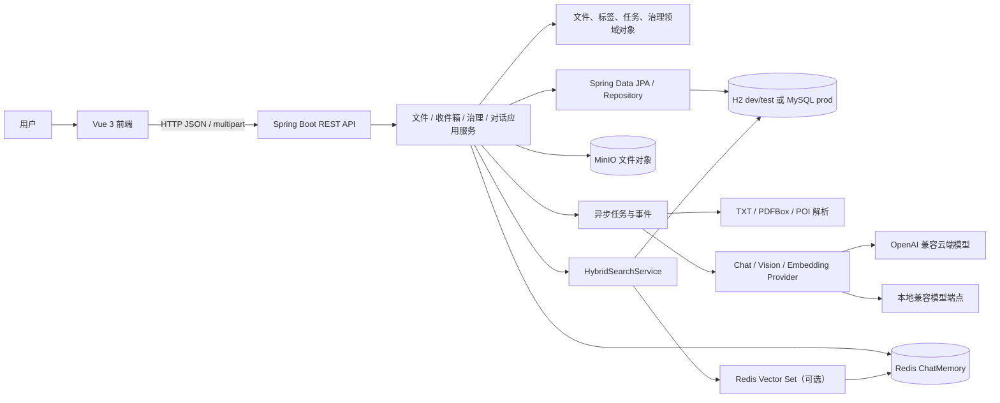
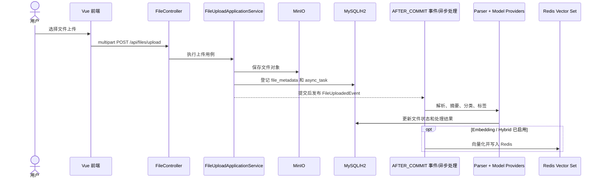
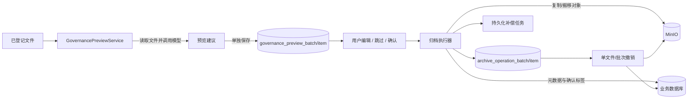
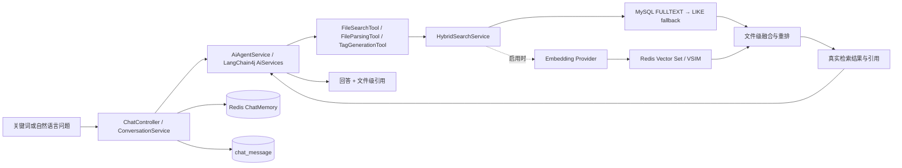
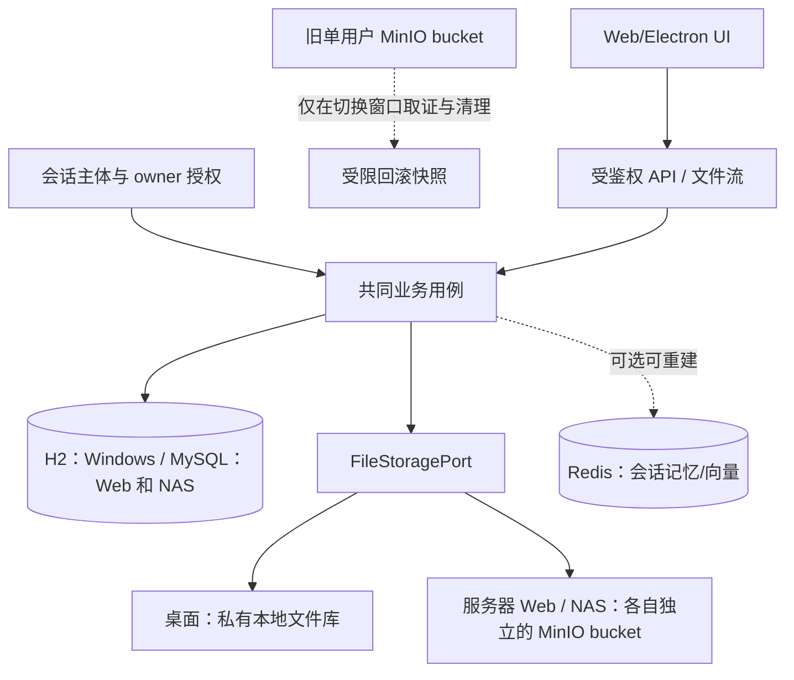

# AgentFS Nexus 架构图与模块关系

> 盘点日期：2026-09-24；状态补记：2026-09-25。本文描述当前代码路径和 Flyway V1–V14，不等于最终生产架构。目标架构和已采纳的存储变更见 [ADR-001](./decisions/ADR-001-最终产品合同与存储架构.md)；实施清单见[最终计划](./plans/AgentFS最终落地执行计划.md)。

## 1. 当前实现：系统边界与模块调用

页面路由主要包括首页、文件、搜索、设置、治理预览和操作台账。前端 API 层调用后端 HTTP 接口；生成的 OpenAPI 类型位于 `frontend/src/api/generated/schema.ts`。

## 2. 关键数据流

### 文件上传和处理

MinIO 对象先于数据库登记写入；数据库失败时上传用例尝试补偿删除对象。解析、模型请求和向量操作在登记事务之后执行。删除文件后的向量清理由数据库任务重试；重建使用临时 generation，校验后切换。

### 治理预览、确认、归档和撤销

预览建议与正式文件元数据分离；只有确认请求才创建正式操作批次。台账保存原/目标路径、分类、对象指纹、执行/撤销状态。MinIO 与 SQL 不能处于同一事务，因此失败状态和补偿任务负责恢复；并发归档命名由保留表和锁表协助分配。

### 搜索和对话

词法检索始终保留；Hybrid/向量功能默认关闭。向量超时、Embedding 或 Redis 异常时回退到词法结果。对话记忆在 Redis，对话记录写数据库；引用来自检索工具收集的文件级结果，不应依赖模型自行生成。

## 3. 模块输入、输出与边界

| 模块 | 输入 | 输出 / 持久化 | 职责边界 |
|---|---|---|---|
| 前端 `views` / `layout` | 用户操作、REST 响应 | 表单、列表、预览、台账、回答和引用 | 页面状态与交互；不自行决定归档路径、目标名或最终治理状态 |
| 前端 `api` | 页面请求 DTO | HTTP 请求和类型化响应 | 维护 API 封装；服务端 DTO 变更通过 OpenAPI 类型生成同步 |
| `file.api` / Controllers | HTTP 路径、查询参数、multipart、JSON | 统一 `Result<T>` / 流响应 | 参数校验和请求映射；不应承载跨资源业务编排 |
| `file.application` | 文件命令、已登记文件 ID | FileMetadata、AsyncTask、API DTO | 上传/查询/生命周期用例、解析管线和事件编排 |
| `file.domain` | 文件属性、生命周期命令 | 状态和值对象 | 文件状态、分类和类型规则；不直接访问网络或模型 |
| `file.infrastructure` | 文件字节、对象路径、存储请求 | 解析文本、MinIO 对象操作和 Repository | PDF/Word/TXT 解析、MinIO 和持久化适配 |
| `inbox` | 受配置目录中的文件快照 | 导入记录、上传任务与进度 | 扫描、稳定性、去重及重试；不是 Windows 本地文件库主存储 |
| `governance` | 文件 ID、预览请求、用户编辑/确认 | 预览结果、操作批次/明细、补偿记录 | Dry-run 隔离、变更确认、归档台账、撤销、冲突和补偿 |
| `tag` | 文件 ID、候选标签及用户决定 | 标签字典和关联状态 | 标签生命周期；历史确认事件直接归档是遗留旁路 |
| `task` | 任务 ID、执行进度/结果 | async_task 和任务视图 | 任务注册、状态推进、进度和重试 |
| `agent` / `tool` / `service` | 用户问题、工具参数、搜索词 | 回答、检索结果、摘要/标签、引用 | Agent 编排和跨领域服务；业务应通过 Provider 接口调用模型 |
| `model.runtime` / `model.provider` | 模式、能力、端点配置、提示词/内容 | 模型回复、Embedding、视觉分析、连通性结果 | Provider 创建和运行模式快照路由；密钥从数据库解密供调用 |
| `vector` | 文件 ID、文本、Embedding | Redis Vector Set 记录及 generation | 索引、删除清理、重建；可选，SQL 元数据仍是文件权威记录 |
| `memory` | conversation ID、LangChain4j 消息帧 | Redis ChatMemory | 会话上下文及过期管理，不承担正式对话记录归档 |
| `config` / `aspect` / `exception` | Spring 配置、带注解方法、异常 | Bean、模型调用日志、统一错误响应 | 基础设施装配、横切日志和错误转换 |

## 4. 外部依赖与数据权威

| 数据 | 权威位置 | 用途 |
|---|---|---|
| 文件元数据、标签、任务、预览、台账、密钥配置 | H2 或 MySQL | 业务数据；prod 为 MySQL |
| 原始文件和归档对象 | MinIO | 文件本体；对象移动是 copy + SQL 更新 + 删除旧对象的多阶段流程 |
| 会话记忆 | Redis | 短期 Agent 对话上下文 |
| 向量索引 | Redis Vector Set | 可重建的检索索引，不作为文件元数据权威来源 |
| AI 推理 | 云端 OpenAI 兼容 API 或本地兼容服务 | Chat、Vision、Embedding；运行模式互斥，非 Web/NAS/桌面部署模式 |

以上是当前代码依赖，不是最终部署要求。目标版本让三种形态共用 FileStoragePort：桌面使用受控本地文件系统适配器且不依赖 MinIO；服务器 Web/NAS 使用 MinIO 适配器与各自独立的私有 bucket、持久卷和备份。MinIO 开源仓库已归档，服务端发布前须落实可维护版本和更新渠道；Redis 继续作为可选、可重建服务。

## 4.1 目标部署数据流（尚未实现）

身份和 owner 由服务端会话派生。管理员不具备通过应用读取用户内容的权限；正文只经授权文件流接口返回，MinIO bucket 不能由 Web 静态服务器或公网直接公开。桌面、服务器、NAS 各自使用独立数据库、正文存储、密钥和备份；无跨实例同步。

## 5. 数据库表结构（Flyway V1–V14）

以下列出迁移脚本中的业务列与主要约束。两套迁移分别位于 `backend/src/main/resources/db/migration/mysql/` 和 `.../h2/`；实际 SQL 类型细节以对应脚本为准。V1–V14 均已存在，新增结构应从 V15 开始并同时维护 H2、MySQL。

| 表 | 主键 / 关键字段 | 用途与主要关系 |
|---|---|---|
| `file_metadata` | `id`; file_name, file_size, file_type, storage_path, upload_time, summary, status, task_id, category, archived, revision, content_etag, vector_indexed_at, vector_index_generation | 文件元数据、生命周期、对象位置、版本快照和向量索引状态 |
| `async_task` | `id`; task_id, file_name, status, progress, result, created_at, updated_at, run_mode | 文件异步处理任务；task_id 唯一 |
| `tag` | `id`; tag_name, category, created_at | 标签字典；tag_name 唯一 |
| `file_tag_mapping` | `id`; file_id, tag_id, confirmation_status, confirmed_at, confirmation_note | 文件与标签关联；(file_id, tag_id) 唯一 |
| `chat_message` | `id`; session_id, user_message, ai_response, timestamp | 对话持久记录 |
| `model_call_log` | `id`; session_id, user_message, ai_response, token 计数, retry_count, response_time_ms, call_time, model_name, status, error_message | 模型调用统计及日志 |
| `model_credential` | `provider` 主键; encrypted_api_key, updated_at | Provider 加密密钥 |
| `vector_cleanup_task` | `id`; file_id, status, attempts, next_attempt_at, last_error, timestamps | 删除后向量清理重试 |
| `vector_reindex_job` | `job_id`; status, total/processed/success/failed/skipped_count, error_summary, timestamps | 向量索引重建进度 |
| `inbox_import_record` | `id`; snapshot_key 唯一, source_path/name/size/modified_at, content_sha256, content_type, status, stable_observations, attempt_count, task_id, file_id, 错误和导入时间 | 收件箱扫描、稳定性、去重和重试 |
| `governance_preview_batch` | `id`; preview_id/request_id 唯一, preview_source, run_mode, created_by, status, 计数, expires_at, 确认/取消时间 | 一次治理预览批次 |
| `governance_preview_item` | `id`; preview_id, file_id, source_revision/path/name/category/etag/size, suggested_file_name/category/path/summary/tags, analysis_model/mode, status, skip/error 信息 | 单文件建议；(preview_id, file_id) 唯一 |
| `archive_operation_batch` | `id`; batch_id/request_id 唯一, preview_id, operation_source, run_mode, status, rollback_status, 各状态计数及时间 | 确认后的归档操作批次 |
| `archive_operation_item` | `id`; batch_id, file_id, item_key 唯一, expected_revision, source/target 名称/分类/路径/etag/size, pre/post_revision, execution/rollback 状态、阶段、attempts、错误、时间 | 单文件操作快照；(batch_id, file_id) 唯一 |
| `governance_compensation_task` | `id`; task_key 唯一, batch_id, item_id, action, status, object_path, attempts, next_attempt_at, last_error, timestamps | 跨 MinIO/数据库失败后的持久化补偿 |
| `model_runtime_setting` | 固定单例 `id`; active_mode, api_validated_at, local_validated_at, updated_at | 当前 API/本地运行模式和验证时间 |
| `model_runtime_endpoint` | `id`; run_mode, capability, base_url, model_name, encrypted_api_key, updated_at | Chat/Vision/Embedding 端点；(run_mode, capability) 唯一 |
| `archive_object_name_allocator_lock` | `id`; lock_name 唯一 | 归档名称序号分配锁 |
| `archive_object_name_reservation` | `id`; business_date, category_slug, normalized_file_name, sequence_number, created_at | 归档文件名保留；日期/分类/规范化名称/序号组合唯一 |

迁移里主要通过唯一键和索引维护幂等、查询性能与并发分配；没有看到这些业务关联使用数据库外键约束，`file_id`、`batch_id`、`item_id` 等关系主要由应用层维护。MySQL V2 还创建 file name / summary 的 ngram FULLTEXT 索引；H2 走测试/开发兼容路径。

## 6. 关键 API 边界

| Controller / 路径 | 输入输出职责 |
|---|---|
| `FileController` `/api/files` | 列表、详情、上传、删除、重命名、重试；旧直接改分类路由返回冲突并要求使用治理预览 |
| `SearchController` `/api/files/search` | 关键词/语义检索与文件列表响应 |
| `FileTagController` `/api/files/tags` | 标签确认、拒绝、候选和联想 |
| `TaskController` `/api/tasks` | 单任务进度、任务概览 |
| `ChatController` `/api/chat/send` | 用户问题 → Agent 回答、sessionId 和引用 |
| `InboxImportController` `/api/inbox-imports/progress` | 批量收件箱导入进度 |
| `GovernancePreviewController` `/api/governance/previews` | 建预览、重新分析、查询、编辑、跳过、确认、取消 |
| `ArchiveOperationController` `/api/governance/operations` | 台账查询、导出、重试、撤销、补偿重试 |
| Model settings/runtime controllers | `/api/settings/models`、`/api/settings/runtime` 及 `/config` 子路径 |
| `VectorAdminController` `/api/admin/vector/reindex` | 启动和查询重建任务 |

统一响应常见格式为 `{"code":0,"msg":"success","data":...}`。OpenAPI：`/v3/api-docs`；Knife4j：`/doc.html`。
